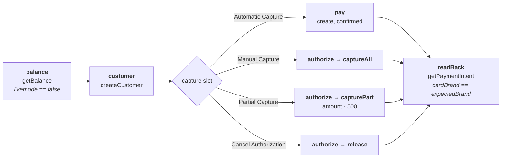
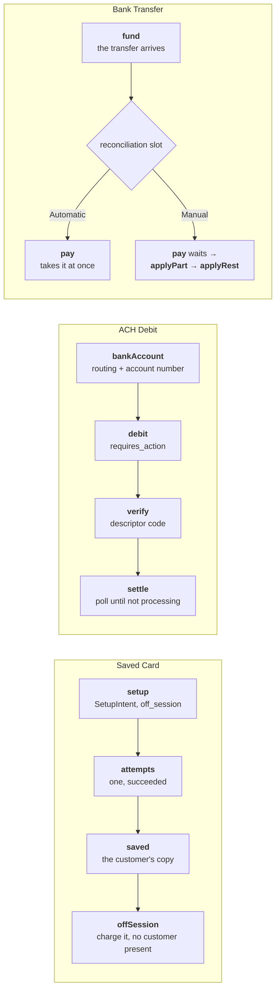
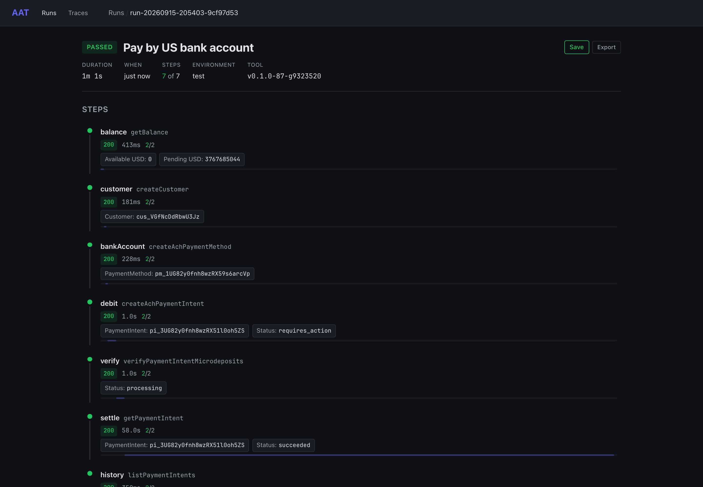
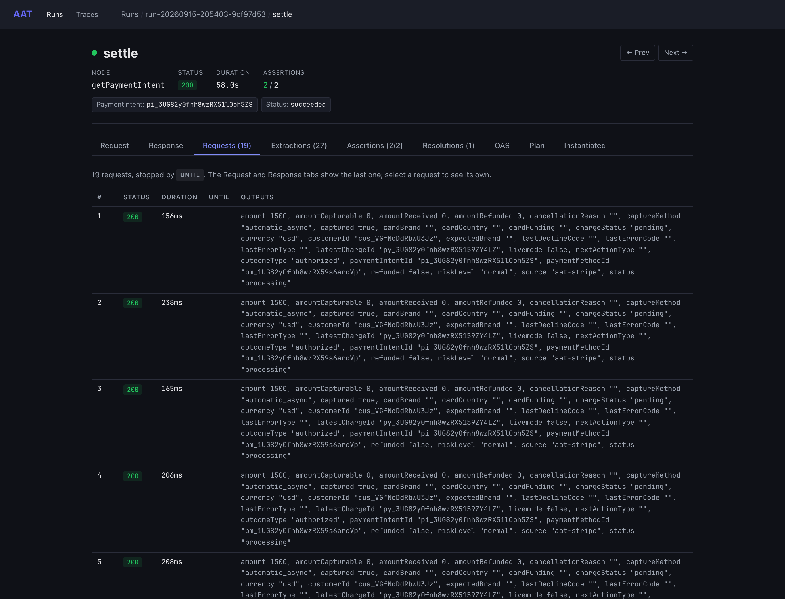
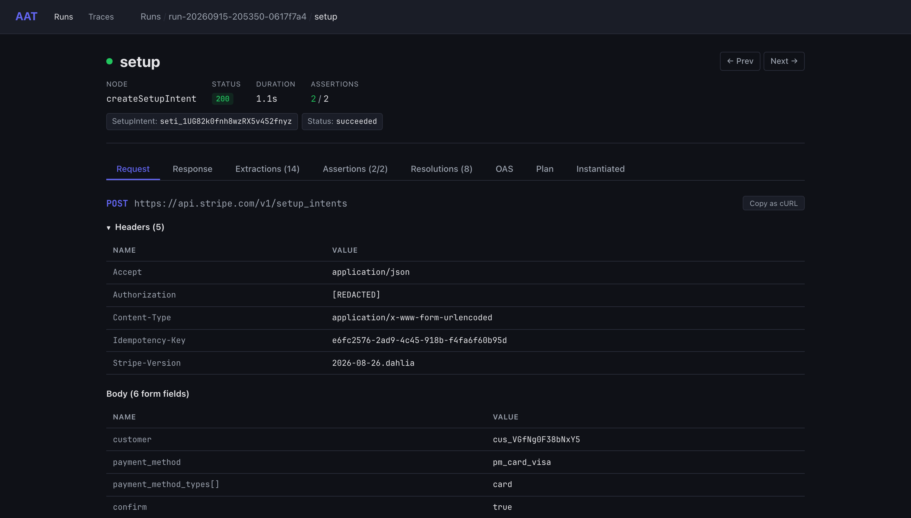
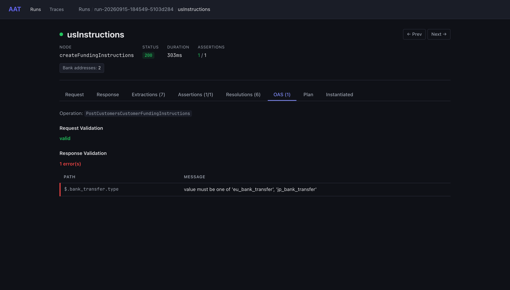
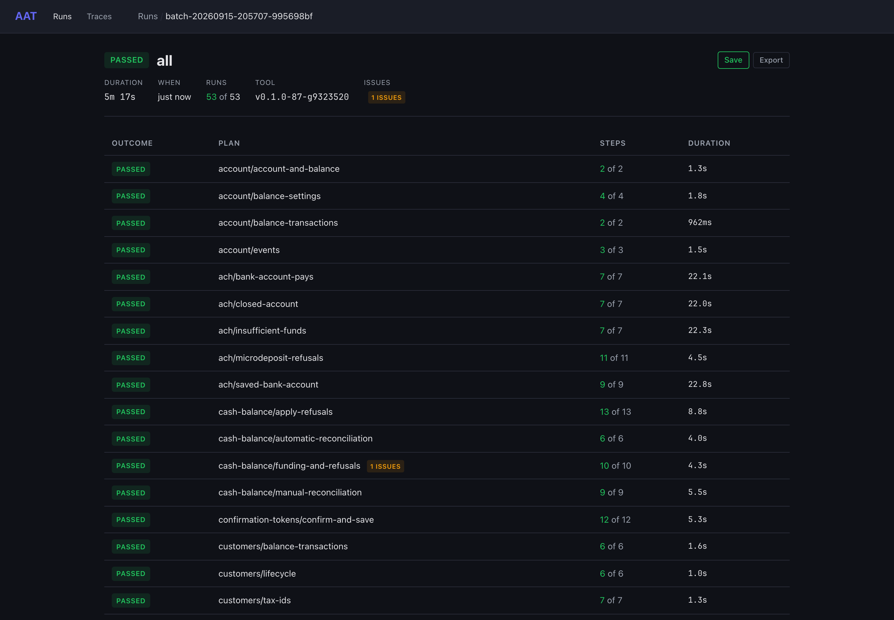
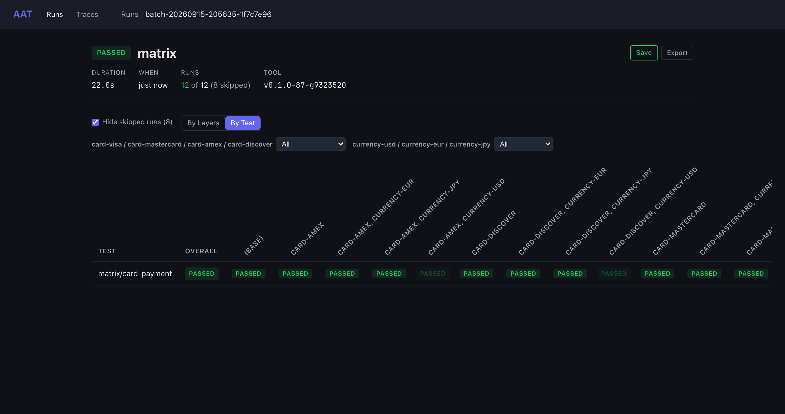

# aat-stripe

Stripe's API in test mode as an [AAT](https://github.com/gburgyan/aat) project. AAT is a command-line tool that
models an API as a graph and runs long, multi-step test plans against it: here a graph gives every operation a node, a
template per node says how the request is built and what comes back, and plans prove what the API really does by
running against Stripe's live test API. Every request and response is checked against
[Stripe's own OpenAPI spec](#the-spec) as it goes.

Everything this README says about Stripe comes from those runs. Where a run showed something no plan asserts yet, it
says *probe*.

**Status:** the account and its reference data, customers, card payments, saved cards, bank debits by ACH and SEPA,
bank transfers into a cash balance, tokens, and search: **82 operations run by 53 plans** that pass together in about
five minutes, with 14 layers crossed into matrices ([what's not covered](#not-covered-yet)).

[](https://github.com/gburgyan/aat-stripe/actions/workflows/nightly.yml)

```text
$ aat run plan setup-intents/saved-card
  [1/6] balance (getBalance) 200  317ms
        Available USD: 0
        Pending USD: 3767683132
  [2/6] customer             200  166ms
        Customer: cus_VGfNg0F38bNxY5
  [3/6] setup                200  1.1s
        SetupIntent: seti_1UG82k0fnh8wzRX5v452fnyz
        Status: succeeded
  [4/6] attempts             200  106ms
        Attempts: 1
  [5/6] saved                200  123ms
        PaymentMethod: pm_1UG82k0fnh8wzRX5ax51R6vg
  [6/6] offSession           200  632ms
        PaymentIntent: pi_3UG82l0fnh8wzRX50L82aVPL
        Status: succeeded

  cleanup:
    getPaymentIntentForCl~ 200  156ms
    getSetupIntentForClea~ 200  122ms
    deleteCustomer         200  387ms
    cancelPaymentIntent    skipped: when status in [...] is false (for getPaymentIntentForCleanup)
    cancelSetupIntent      skipped: when status in [...] is false (for getSetupIntentForCleanup)

PASSED (6/6 steps, 3.1s)
```

That run saved a customer's card with a SetupIntent confirmed for off-session use, checked that the SetupIntent
succeeded on one attempt, read the PaymentMethod the customer now holds — Stripe's own copy of the test card, with an
ID of its own — and charged it with no customer present. Then cleanup read both intents, left them alone because they
had succeeded, and deleted the customer.

## Three ways to read this project

Three things at once, and they are the same files.

- **A worked Stripe integration.** Each node names a Stripe operation, the inputs it takes, and the outputs worth
  keeping, and its description says what the API does with them. The templates are the request bodies, including the
  bracketed form keys Stripe wants (`metadata[source]`, `payment_method_options[card][cvc_token]`). If you are building
  against Stripe, the graph and [`domain.yaml`](domain.yaml) are a reference whose every claim has a run behind it.
- **A test suite Stripe's API could be run against.** 53 plans cover the money path end to end, each asserting the
  exact status, error `code`, `decline_code`, and `param` Stripe answers with. Point it at any test-mode key and it
  says what changed.
- **A demonstration of AAT.** Workflows with slots, layers crossed into a matrix, cleanup chains, polling, paging,
  guards, strict OpenAPI validation against a vendored spec, and the archive that records all of it. See
  [AAT features on display](#aat-features-on-display) and [How this was built](#how-this-was-built).

It is one of three such projects, with [aat-duffel](https://github.com/gburgyan/aat-duffel) and
[aat-shippo](https://github.com/gburgyan/aat-shippo); [Real APIs](https://gburgyan.github.io/aat/examples/real-apis/)
compares them.

## Getting started

### What you need

- **`aat` v0.2.0 or later**, which carries the features this project needed (see
  [How this was built](#how-this-was-built)). Install it with Homebrew, a release archive, Docker, or `go install` —
  see [Install](https://gburgyan.github.io/aat/install/):

  ```bash
  brew install gburgyan/tap/aat
  ```

  A `go install` build has every CLI feature but no web UI, so `aat web view latest` needs a release build or Homebrew.

- **A Stripe account in test mode,** based in the US, with a test secret key (`sk_test_…`):

  ```bash
  export STRIPE_API_KEY=sk_test_...   # the variable the Stripe CLI reads
  ```

### Nothing here can move real money

Every node that creates an object fails a response whose `livemode` is true, so a live key stops a plan at its first
object. Every object a plan creates carries `metadata[source]=aat-stripe`, cleanup removes it, and the
[guards](#guards-and-cleanup) fail if anything is left.

A PaymentIntent's `client_secret`, a microdeposit verification page, and a bank transfer's instructions page are
credentials. No output holds them, so they never print or reach a display, but raw responses stay in the run archives
under `_output/`, which git ignores.

Some phases need something switched on in the Dashboard: Connect with a platform profile, Issuing, Tax with a head
office address, and a Radar rule for reviews. What this account refuses today is listed under
[not covered](#not-covered-yet), asserted rather than assumed.

### Run it

```bash
aat validate --strict                      # every file, template, workflow, and plan; no requests sent
aat run plan setup-intents/saved-card      # the run above
aat run plan ach/bank-account-pays         # verify a bank account with microdeposits, then debit it
aat run plan declines/insufficient-funds   # the exact error Stripe answers with, then a card that works
aat run batch --env test-ci                # all 53 plans, paced, with the guards last
aat run batch matrix --env test-ci --layer-group card-visa,card-mastercard,card-amex,card-discover
aat run show latest                        # what the last run sent and got back
aat web view latest                        # open it in the browser
```

Reading a run without the browser:

```bash
aat run show latest --step offSession --outputs             # what a step extracted
aat run show latest --step offSession --response --shape    # the response's structure, one path per line
aat run show latest --step setup --request                  # the form body, as its fields
aat run show latest --step settle --iteration 19            # one request of a polled step
```

### Environments

| Environment | What it does |
|---|---|
| `test` (default) | `Stripe-Version: 2026-08-26.dahlia`, the spec's version, and `oasValidation: strict`: a request or response the spec doesn't allow fails the step |
| `test-ci` | `test`, with request starts at least 60 ms apart, for long batches under Stripe's 25 requests a second |
| `test-auto` | `test`, with spec findings reported rather than failing a step, for [drift/funding-instructions](drift/funding-instructions.yaml), [a response Stripe's own spec doesn't describe](#stripes-own-spec-doesnt-describe-one-of-its-responses) |
| `account-default` | No `Stripe-Version`, so Stripe answers at the account's default API version, with findings reported |

`packageEpoch` is the Unix time the project started; the guards look at objects created since then. `webhookUrl` is
where webhook plans will point, `https://example.com/aat-stripe/webhooks` unless `--var webhookUrl=…` says otherwise.

## Point your coding assistant at it

The same files are an MCP server. [`.mcp.json`](.mcp.json) registers two, and Claude Code loads them when it opens
this directory; other clients take the same commands:

- **`stripe-api`** (`aat mcp serve --persona api`): read-only tools that hand an assistant each operation's exact
  request, the order calls go in, what each needs from the calls before it, the domain's rules, the spec's schemas,
  and sample responses from real runs. Ask it for a client in your language and it has the whole workflow to work
  from, not a pile of endpoint reference.
- **`stripe-test`** (`--persona test`): the tools to write, validate, run, and debug plans against your own test
  account, with `STRIPE_API_KEY` in the environment.

[MCP server](https://gburgyan.github.io/aat/mcp-server/) covers the tools, other clients, and the HTTP transport.

## How the plans fit together

Five workflows carry most of the project, each with a slot that chooses how the story ends. A plan that reuses one is a
**recipe**: it names the workflow, picks the slot, and AAT composes the full plan when it runs. Here is the whole of
the manual-capture plan:

```yaml
kind: recipe
metadata:
  prompt: Authorize a card, then capture it
  graphVersion: "1.0.0"
selection:
  workflow: Card Payment
  description: Authorized, then captured in full
  choices:
    capture: Manual Capture
```

### Card Payment, and Declined Card



Every plan reads the balance first and fails if it isn't test mode. Declined Card is the same shape with a `decline`
slot of eight cards: it creates a PaymentIntent without one (`create`), the slot confirms it with a card that fails and
asserts Stripe's exact error, then `afterDecline` checks the PaymentIntent is still open with that decline recorded and
`retry` pays it with a card that works.

### Saved Card, ACH Debit, and Bank Transfer



An ACH debit is not instant, so the `settle` step reads the payment until the bank has answered. In the run below that
took 19 requests over 58 seconds, and `aat run show` lists every one of them:

```yaml
- id: settle
  node: getPaymentIntent
  repeat:
    until: status != "processing"
    interval: 3s
    max: 40
    timeout: 150s
```

```text
$ aat run plan ach/bank-account-pays
  [4/7] debit                200  1.0s
        PaymentIntent: pi_3UG82y0fnh8wzRX51l0oh5ZS
        Status: requires_action
  [5/7] verify               200  1.0s
        Status: processing
  [6/7] settle               200  58.0s  19 requests
        Status: succeeded
  [7/7] history              200  350ms
        PaymentIntents: 1
        Ours: 1
        Ours still open: 0

PASSED (7/7 steps, 61.8s)
```

### Guards and cleanup

Every object a plan creates is registered for cleanup as it is created. A PaymentIntent's cleanup is a chain: read its
status, then cancel it only while it can be canceled.

```yaml
createPaymentIntent:
  cleanup:
    node: getPaymentIntentForCleanup
    releasedBy: [cancelPaymentIntent]

getPaymentIntentForCleanup:
  cleanup:
    node: cancelPaymentIntent
    when: 'status in ["requires_payment_method", "requires_confirmation", "requires_action", "requires_capture"]'
```

A plan that cancels the PaymentIntent itself releases the entry, and `aat run show` says so. In the last full batch
cleanup ran 44 customer deletes, 45 status reads, and 9 cancels, with 0 failures: `when` skipped 37 cancels on
intents that had already closed, and a plan's own cancel or delete released 4 more.

Then the three [`zz-guard/`](plans/zz-guard/) plans, which sort last, read every page of customers, PaymentIntents,
and SetupIntents created since the project started, and fail if one of ours is left:

```yaml
- id: paymentIntents
  node: listPaymentIntents
  values:
    limit: 100
    createdGte: "{{env.packageEpoch}}"
  repeat:
    next: {startingAfter: lastId}
    until: hasMore == false
    collect: [count, ourCount, ourOpenCount, ourOpen, liveCount]
    max: 100
  assertions:
    mechanical:
      - type: predicate
        expr: ourOpenCount == 0 && liveCount == 0
```

Objects from other work on the same account are counted apart and never fail it. The guards have earned their place:
they caught the first PaymentIntent a refused create left behind, and the customers a half-finished run left holding a
cash balance, which Stripe won't let you delete.

### Finding the object a refusal left behind

Several of Stripe's refusals still create something. No success response names it, so the plan lists the customer's
PaymentIntents and picks the one the refusal left, by a filter that reads an earlier step's output:

```yaml
paymentIntentId:
  from: open.paymentIntents
  select:
    strategy: first
    field: id
    filter: status == "requires_confirmation"
```

## See it in the web UI

`aat web view latest` opens a run as a timeline of its steps, each with its status, timing, and the outputs the graph
marks for display. This is the ACH debit: the bank account created, the debit waiting in `requires_action`, the
microdeposits verified, and 58 seconds of polling before it settled.



A step's page shows its request, response, extracted outputs, assertions, and how each input was resolved. A repeated
step also gets a **Requests** tab, one row per request: here all 19 reads of the debit, the last of which met the
condition that stopped it.



Every Stripe write is form-encoded, so a request body is a row per field rather than one escaped string. The
`Authorization` header is redacted in the archive itself, not just in the view.



The **OAS** tab is where strict validation shows its work. This is the funding-instructions response: the request
validated, and the response did not, because Stripe's own spec doesn't allow the `bank_transfer.type` its live API
answered with.



A batch gets its own page: every plan, its steps, and its duration, with the issues badge counting the one deliberate
spec violation.



## Layers and matrix runs

A layer fills inputs a plan leaves unset. The project's layers vary the card, the currency, and the amount; each sets
inputs of `createPaymentIntent` only, so a plan that names its own card keeps it.

| Layers | Inputs | Values (and without the layer) |
|---|---|---|
| `card-visa`, `card-visa-debit`, `card-mastercard`, `card-amex`, `card-discover`, `card-diners`, `card-jcb`, `card-unionpay` | `paymentMethod`, `expectedBrand` | the test card each names, and the brand its charge must come back with (`pm_card_visa`, `visa`) |
| `currency-usd`, `currency-eur`, `currency-gbp`, `currency-jpy` | `currency` | the currency each names; yen is zero-decimal, so 2000 is ¥2000 (`usd`) |
| `amount-small`, `amount-large` | `amount` | 1000 and 250000 (2000) |

[`plans/matrix/card-payment.yaml`](plans/matrix/card-payment.yaml) is the matrix's row: one card payment, whatever the
layers choose. Every cell proves its layers took effect, because Card Payment's last step asserts that the charge came
back with the brand the layer named:

```yaml
- type: predicate
  expr: livemode == false && customerId == "{{customer.customerId}}" && cardBrand == expectedBrand
```

```bash
aat run batch matrix --env test-ci \
  --layer-group card-visa,card-mastercard,card-amex,card-discover \
  --layer-group currency-usd,currency-eur,currency-jpy
```

That crosses four card layers and three currency layers, each group also contributing "none": 20 permutations, run in
22 seconds.

| Batch | Runs | Result | Time |
|---|---|---|---|
| Card × currency | 1 plan × 20 | 12 passed, 8 skipped as duplicates | 22 s |

The eight skips are dedup at work. `card-visa` sets the card the graph already defaults to, and `currency-usd` the
currency, so every combination naming either builds a plan that another combination already built, and AAT runs it
once:

```text
aat: dedup — 8 duplicate permutations detected:
  matrix/card-payment [card-visa] → duplicate of matrix/card-payment [(base)]
  matrix/card-payment [card-visa, currency-usd] → duplicate of matrix/card-payment [(base)]
  matrix/card-payment [currency-usd] → duplicate of matrix/card-payment [(base)]
  matrix/card-payment [card-visa, currency-eur] → duplicate of matrix/card-payment [currency-eur]
  matrix/card-payment [card-amex, currency-usd] → duplicate of matrix/card-payment [card-amex]
  …
```

The twelve that ran are the real cells: Mastercard, American Express, and Discover, each in dollars, euros, and yen,
plus the three currencies on the default Visa. Every one of them ended with its charge carrying the brand its layer
named.

A batch's **By Test** view draws the matrix — a row per plan, a column per combination of layers, and a filter per
group:



Run layer groups on [`plans/matrix/`](plans/matrix/) only. The other plans pin what they prove to a card or a currency —
a decline plan names the card whose error it asserts, and the partial-capture plan captures `amount - 500` — so a layer
that changes those would fail them by design.

## What's exercised

### Operations

Each operation is a node in [`graph.yaml`](graph.yaml), with a template in [`templates/`](templates/) and its
`operationId` from Stripe's spec. Every node runs in at least one plan; the cleanup nodes run in cleanup.

| Operation | Node | Proven by |
|---|---|---|
| `GET /v1/account` | `getAccount` | [account-and-balance](plans/account/account-and-balance.yaml) |
| `GET /v1/balance` | `getBalance` | [account-and-balance](plans/account/account-and-balance.yaml), every payment workflow |
| `GET /v1/balance_transactions`, `GET /v1/balance_transactions/{id}` | `listBalanceTransactions`, `getBalanceTransaction` | [balance-transactions](plans/account/balance-transactions.yaml) |
| `GET /v1/balance_settings`, `POST /v1/balance_settings` | `getBalanceSettings`, `updateBalanceSettings` | [balance-settings](plans/account/balance-settings.yaml), [conflict](plans/idempotency/conflict.yaml) |
| `GET /v1/country_specs`, `GET /v1/country_specs/{country}` | `listCountrySpecs`, `getCountrySpec` | [country-specs](plans/reference/country-specs.yaml) |
| `GET /v1/tax_codes`, `GET /v1/tax_codes/{id}` | `listTaxCodes`, `getTaxCode` | [tax-codes](plans/reference/tax-codes.yaml) |
| `GET /v1/events`, `GET /v1/events/{id}` | `listEvents`, `getEvent` | [events](plans/account/events.yaml), [account-default](drift/account-default.yaml) |
| `POST /v1/customers` | `createCustomer` | [lifecycle](plans/customers/lifecycle.yaml), [replay](plans/idempotency/replay.yaml), and every payment, PaymentMethod, and SetupIntent plan |
| `GET /v1/customers/{customer}`, `POST /v1/customers/{customer}` | `getCustomer`, `updateCustomer` | [lifecycle](plans/customers/lifecycle.yaml), [update-and-search](plans/customers/update-and-search.yaml) |
| `GET /v1/customers`, `DELETE /v1/customers/{customer}` | `listCustomers`, `deleteCustomer` | [lifecycle](plans/customers/lifecycle.yaml), [customers guard](plans/zz-guard/customers.yaml), and cleanup everywhere |
| `GET /v1/customers/search` | `searchCustomers` | [update-and-search](plans/customers/update-and-search.yaml), polled |
| `POST`, `GET`, `POST /v1/customers/{customer}/balance_transactions[/{transaction}]` | `createCustomerBalanceTransaction`, `getCustomerBalanceTransaction`, `updateCustomerBalanceTransaction`, `listCustomerBalanceTransactions` | [balance-transactions](plans/customers/balance-transactions.yaml) |
| `POST`, `GET`, `DELETE /v1/customers/{customer}/tax_ids[/{id}]` | `createTaxId`, `getTaxId`, `listTaxIds`, `deleteTaxId` | [tax-ids](plans/customers/tax-ids.yaml), and cleanup |
| `POST /v1/payment_intents` | `createPaymentIntent` | every plan in [payments](plans/payments/), [declines](plans/declines/), [refunds](plans/refunds/), [matrix](plans/matrix/), and the saved-card plans |
| `GET /v1/payment_intents/{intent}`, `POST /v1/payment_intents/{intent}` | `getPaymentIntent`, `updatePaymentIntent` | every payment workflow, [update-and-list](plans/payments/update-and-list.yaml), ACH and SEPA polling, and cleanup |
| `POST /v1/payment_intents/{intent}/confirm` | `confirmPaymentIntent` | every plan in [declines](plans/declines/) |
| `POST /v1/payment_intents/{intent}/capture` | `capturePaymentIntent` | [manual-capture](plans/payments/manual-capture.yaml), [partial-capture](plans/payments/partial-capture.yaml), [three-d-secure](plans/payments/three-d-secure.yaml) |
| `POST /v1/payment_intents/{intent}/cancel` | `cancelPaymentIntent` | [cancel-authorization](plans/payments/cancel-authorization.yaml), the plans that clean up after a refusal, and cleanup |
| `POST /v1/payment_intents/{intent}/increment_authorization` | `incrementAuthorization` | [increment-authorization](plans/payments/increment-authorization.yaml), refused |
| `GET /v1/payment_intents` | `listPaymentIntents` | [update-and-list](plans/payments/update-and-list.yaml), the refusal plans, [PaymentIntents guard](plans/zz-guard/payment-intents.yaml) |
| `POST /v1/refunds`, `GET /v1/refunds/{refund}`, `POST /v1/refunds/{refund}`, `GET /v1/refunds` | `createRefund`, `getRefund`, `updateRefund`, `listRefunds` | every plan in [refunds](plans/refunds/) |
| `GET /v1/charges/{charge}`, `POST /v1/charges/{charge}`, `GET /v1/charges` | `getCharge`, `updateCharge`, `listCharges` | [partial-refund](plans/refunds/partial-refund.yaml), [refund-reads](plans/refunds/refund-reads.yaml) |
| `POST /v1/payment_methods` | `createPaymentMethod` | [attach-and-detach](plans/payment-methods/attach-and-detach.yaml) |
| `GET`, `POST /v1/payment_methods/{payment_method}` | `getPaymentMethod`, `updatePaymentMethod` | [attach-and-detach](plans/payment-methods/attach-and-detach.yaml) |
| `POST /v1/payment_methods/{payment_method}/attach`, `/detach` | `attachPaymentMethod`, `detachPaymentMethod` | [attach-and-detach](plans/payment-methods/attach-and-detach.yaml), [authentication](plans/setup-intents/authentication.yaml) |
| `GET /v1/payment_methods`, `GET /v1/customers/{customer}/payment_methods[/{payment_method}]` | `listPaymentMethods`, `listCustomerPaymentMethods`, `getCustomerPaymentMethod` | [attach-and-detach](plans/payment-methods/attach-and-detach.yaml), [saved-card](plans/setup-intents/saved-card.yaml) |
| `POST /v1/setup_intents` | `createSetupIntent` | every plan in [setup-intents](plans/setup-intents/) |
| `GET`, `POST /v1/setup_intents/{intent}` | `getSetupIntent`, `updateSetupIntent` | [update-confirm-cancel](plans/setup-intents/update-confirm-cancel.yaml), and cleanup |
| `POST /v1/setup_intents/{intent}/confirm`, `/cancel` | `confirmSetupIntent`, `cancelSetupIntent` | [update-confirm-cancel](plans/setup-intents/update-confirm-cancel.yaml), [authentication](plans/setup-intents/authentication.yaml), and cleanup |
| `GET /v1/setup_intents`, `GET /v1/setup_attempts` | `listSetupIntents`, `listSetupAttempts` | [saved-card](plans/setup-intents/saved-card.yaml), [SetupIntents guard](plans/zz-guard/setup-intents.yaml) |
| `POST /v1/payment_methods` (`us_bank_account`), `POST /v1/payment_intents` (`us_bank_account`) | `createAchPaymentMethod`, `createAchPaymentIntent` | every plan in [ach](plans/ach/) |
| `POST /v1/payment_intents/{intent}/verify_microdeposits` | `verifyPaymentIntentMicrodeposits` | the ACH Debit recipes, [microdeposit-refusals](plans/ach/microdeposit-refusals.yaml) |
| `POST /v1/setup_intents` (`us_bank_account`), `POST /v1/setup_intents/{intent}/verify_microdeposits` | `createAchSetupIntent`, `verifySetupIntentMicrodeposits` | [saved-bank-account](plans/ach/saved-bank-account.yaml) |
| `GET /v1/mandates/{mandate}` | `getMandate` | [saved-bank-account](plans/ach/saved-bank-account.yaml), [direct-debit](plans/sepa/direct-debit.yaml) |
| `POST /v1/payment_methods` (`sepa_debit`), `POST /v1/payment_intents` (`sepa_debit`) | `createSepaPaymentMethod`, `createSepaPaymentIntent` | [direct-debit](plans/sepa/direct-debit.yaml) |
| `GET`, `POST /v1/customers/{customer}/cash_balance` | `getCashBalance`, `updateCashBalance` | every plan in [cash-balance](plans/cash-balance/) |
| `POST /v1/customers/{customer}/funding_instructions` | `createFundingInstructions` | [funding-instructions](drift/funding-instructions.yaml), under `auto` validation |
| `POST /v1/test_helpers/customers/{customer}/fund_cash_balance` | `fundCashBalance` | every plan in [cash-balance](plans/cash-balance/), [refund-gates](plans/refunds/refund-gates.yaml) |
| `GET /v1/customers/{customer}/cash_balance_transactions[/{transaction}]` | `listCashBalanceTransactions`, `getCashBalanceTransaction` | [funding-and-refusals](plans/cash-balance/funding-and-refusals.yaml), the Bank Transfer recipes |
| `POST /v1/payment_intents` (`customer_balance`), `POST /v1/payment_intents/{intent}/apply_customer_balance` | `createBankTransferPaymentIntent`, `applyCustomerBalance` | every plan in [cash-balance](plans/cash-balance/) |
| `POST /v1/tokens`, `GET /v1/tokens/{token}` | `createToken`, `getToken` | [tokens](plans/tokens/tokens.yaml) |
| `POST /v1/test_helpers/confirmation_tokens`, `GET /v1/confirmation_tokens/{confirmation_token}` | `createConfirmationToken`, `getConfirmationToken` | [confirm-and-save](plans/confirmation-tokens/confirm-and-save.yaml) |
| `GET /v1/payment_intents/search`, `GET /v1/charges/search` | `searchPaymentIntents`, `searchCharges` | [payment-intents-and-charges](plans/search/payment-intents-and-charges.yaml) |
| `POST /v1/refunds/{refund}/cancel`, `POST /v1/test_helpers/refunds/{refund}/expire` | `cancelRefund`, `expireRefund` | [refund-gates](plans/refunds/refund-gates.yaml), refused |

### Plans

| Plan | What it proves |
|---|---|
| [account/account-and-balance](plans/account/account-and-balance.yaml) | The key reaches a test-mode balance, and the US account behind it can take charges, with the capabilities later plans rely on |
| [account/balance-settings](plans/account/balance-settings.yaml) | Settings written back as they are: the payout interval is accepted, and an activated account can't change the negative-balance debit even to the value it already has |
| [account/balance-transactions](plans/account/balance-transactions.yaml) | A page of the balance's transactions, newest first, and the newest read by ID with its currency, status, and source |
| [account/events](plans/account/events.yaml) | A customer's `customer.created` event, found by type since its creation time, naming the customer and the request that made it |
| [reference/country-specs](plans/reference/country-specs.yaml) | Every country an account can be in, 100 a page, then the US on its own: USD, with more than 100 payment currencies |
| [reference/tax-codes](plans/reference/tax-codes.yaml) | Every product tax code, paged until `has_more` is false, then the account's default code read on its own |
| [customers/lifecycle](plans/customers/lifecycle.yaml) | A customer created, read, listed, and deleted. A deleted customer still reads 200 with `deleted: true`, and deleting it again is 404 `resource_missing` |
| [customers/update-and-search](plans/customers/update-and-search.yaml) | An update changes only what it names, and search finds the customer once the index catches up; an unsearchable field is refused |
| [customers/balance-transactions](plans/customers/balance-transactions.yaml) | A credit of 500 then a debit of 700: each records the balance after it, and the list comes newest first |
| [customers/tax-ids](plans/customers/tax-ids.yaml) | An `eu_vat` number starts `pending` with its country; an invalid value and a second delete are both refused exactly |
| [idempotency/replay](plans/idempotency/replay.yaml) | The same key and parameters twice: the second answer replays the first, with `Idempotent-Replayed` and `Original-Request` |
| [idempotency/conflict](plans/idempotency/conflict.yaml) | One key reused with other parameters, and on another endpoint: 400 `idempotency_error`, and nothing changes |
| [payments/automatic-capture](plans/payments/automatic-capture.yaml), [manual-capture](plans/payments/manual-capture.yaml), [partial-capture](plans/payments/partial-capture.yaml), [cancel-authorization](plans/payments/cancel-authorization.yaml) | The four capture paths: paid at once, authorized then captured, captured in part with the rest released, and canceled |
| [payments/update-and-list](plans/payments/update-and-list.yaml) | An unconfirmed PaymentIntent changes amount, description, and metadata, and is found under its customer |
| [payments/three-d-secure](plans/payments/three-d-secure.yaml) | A card that needs authentication stops at `requires_action`; capturing it then is refused, and `error_on_requires_action` leaves a PaymentIntent the plan finds and cancels |
| [payments/increment-authorization](plans/payments/increment-authorization.yaml) | Incremental authorization is gated on this account, and the refused create still leaves a PaymentIntent |
| the eight [declines](plans/declines/) | Each test card's exact `code`, `decline_code`, `param`, and `advice_code`; the PaymentIntent stays open and a working card then pays it |
| [refunds/full-refund](plans/refunds/full-refund.yaml), [partial-refund](plans/refunds/partial-refund.yaml) | A refund in full, and two partial refunds that add up to the payment and leave the charge refunded |
| [refunds/refund-limits](plans/refunds/refund-limits.yaml) | More than was paid, a charge already refunded, and an authorization that was never captured: three different refusals |
| [refunds/refund-reads](plans/refunds/refund-reads.yaml) | A refund and its charge from every side: updated, read back, listed, and counted |
| [refunds/refund-gates](plans/refunds/refund-gates.yaml) | What this account can't do: a bank transfer refund needs a verified account email, and a card refund can be neither canceled nor expired |
| [payment-methods/attach-and-detach](plans/payment-methods/attach-and-detach.yaml) | A card attached, updated, listed, and detached for good: reattaching, detaching again, and reading it under the customer are all refused |
| [setup-intents/saved-card](plans/setup-intents/saved-card.yaml) | A card saved for off-session use and charged later, with one setup attempt and the customer's own copy of the card |
| [setup-intents/update-confirm-cancel](plans/setup-intents/update-confirm-cancel.yaml) | A SetupIntent's states: updated while open, confirmed to succeeded, and canceling a closed one refused |
| [setup-intents/authentication](plans/setup-intents/authentication.yaml) | Authentication on setup stops at `requires_action`; a declined card and an off-session charge that needs authentication each leave an object the plan cancels |
| [ach/bank-account-pays](plans/ach/bank-account-pays.yaml), [insufficient-funds](plans/ach/insufficient-funds.yaml), [closed-account](plans/ach/closed-account.yaml) | The three test accounts: one settles about 20 seconds after verification, two fail afterward with the bank's reason |
| [ach/microdeposit-refusals](plans/ach/microdeposit-refusals.yaml) | A debit without a mandate, a wrong descriptor code, one amount instead of two, and verifying an intent that isn't waiting |
| [ach/saved-bank-account](plans/ach/saved-bank-account.yaml) | A verified SetupIntent saves the bank account with a multi-use mandate, which a later off-session debit reuses |
| [sepa/direct-debit](plans/sepa/direct-debit.yaml) | A euro debit settling through `processing`, with its mandate, and the failing test IBAN that fails after being taken |
| [cash-balance/automatic-reconciliation](plans/cash-balance/automatic-reconciliation.yaml), [manual-reconciliation](plans/cash-balance/manual-reconciliation.yaml) | A bank transfer that pays as it arrives, and one applied by hand in two parts |
| [cash-balance/funding-and-refusals](plans/cash-balance/funding-and-refusals.yaml) | Money arriving, what it records, an amount below 1 refused, an unknown reconciliation mode refused, and the balance spent to zero |
| [cash-balance/apply-refusals](plans/cash-balance/apply-refusals.yaml) | `apply_customer_balance` refusing more than remains, another currency, a payment already paid, and a card payment |
| [tokens/tokens](plans/tokens/tokens.yaml) | Bank account, PII, and CVC tokens; a CVC token spent once and refused again; and four ways a token request is refused |
| [confirmation-tokens/confirm-and-save](plans/confirmation-tokens/confirm-and-save.yaml) | A ConfirmationToken's 12-hour life, the one payment it confirms, the card it saves, and its two refusals |
| [search/payment-intents-and-charges](plans/search/payment-intents-and-charges.yaml) | Search finds a new payment once the index catches up, compares amounts, pages with `next_page`, and refuses a bad field and a missing query |
| [matrix/card-payment](plans/matrix/card-payment.yaml) | One card payment for whatever the layers choose, with the charge's brand matching the layer |
| the three [zz-guard](plans/zz-guard/) plans | No customer, PaymentIntent, or SetupIntent of ours is left behind, across every page since the project started |
| [drift/account-default](drift/account-default.yaml), [drift/funding-instructions](drift/funding-instructions.yaml) | What changes at the account's default API version, and the response Stripe's own spec doesn't describe |

## What Stripe does in test mode

These notes come from the runs, and each names the plan that asserts it. They are also in
[`domain.yaml`](domain.yaml), where AI tools that read the project find them. Items marked *probe* were seen in one-off
requests and aren't asserted yet.

- **Declines, exactly.** Each is 402 `card_error` naming the PaymentIntent, which stays `requires_payment_method` with
  the error recorded, and a working card then pays it.

  | Test card | `code` | `decline_code` | `param` | `advice_code` |
  |---|---|---|---|---|
  | `pm_card_visa_chargeDeclined` | `card_declined` | `generic_decline` | — | `try_again_later` |
  | `pm_card_visa_chargeDeclinedInsufficientFunds` | `card_declined` | `insufficient_funds` | — | `try_again_later` |
  | `pm_card_visa_chargeDeclinedLostCard` | `card_declined` | `lost_card` | — | `do_not_try_again` |
  | `pm_card_visa_chargeDeclinedStolenCard` | `card_declined` | `stolen_card` | — | `do_not_try_again` |
  | `pm_card_chargeDeclinedExpiredCard` | `expired_card` | `expired_card` | `exp_month` | `confirm_card_data` |
  | `pm_card_chargeDeclinedIncorrectCvc` | `incorrect_cvc` | `incorrect_cvc` | `cvc` | `confirm_card_data` |
  | `pm_card_chargeDeclinedProcessingError` | `processing_error` | `processing_error` | — | `try_again_later` |
  | `pm_card_chargeDeclinedFraudulent` | `card_declined` | `fraudulent` | — | — |

  [declines](plans/declines/)
- **Capture.** A manual-capture PaymentIntent waits in `requires_capture` with its whole amount capturable. Capturing
  all but 500 receives that much, releases the rest, and ends `succeeded` with nothing left to capture. Canceling
  instead ends `canceled` with the reason given.
  [manual-capture](plans/payments/manual-capture.yaml), [partial-capture](plans/payments/partial-capture.yaml),
  [cancel-authorization](plans/payments/cancel-authorization.yaml)
- **3D Secure.** A card that requires it stops at `requires_action` with a `redirect_to_url` next action, and capturing
  it then is 400 `payment_intent_unexpected_state`. With `error_on_requires_action`, the create is 402
  `authentication_required` with decline code `authentication_not_handled`. Charged off session, a saved card that
  requires authentication is 402 `authentication_required` with decline code `authentication_required`.
  [three-d-secure](plans/payments/three-d-secure.yaml), [authentication](plans/setup-intents/authentication.yaml)
- **A refused create still makes an object.** Each of these leaves a PaymentIntent open in `requires_payment_method`:
  the 3D Secure refusal, the incremental authorization refusal, the off-session authentication refusal, and a CVC token
  used twice. An ACH debit without a mandate leaves one in `requires_confirmation`, and a declined SetupIntent create
  leaves its SetupIntent open. No success response names them, so each plan lists the customer's objects and cancels
  the one the refusal left. The PaymentIntents guard caught the first one a plan missed.
- **Refunds.** Card refunds succeed at once. Two partial refunds add up to the payment and leave the charge refunded.
  Stripe refuses more than was paid (400 on param `amount`, with no code), a second full refund (400
  `charge_already_refunded`), and an authorization that wasn't captured (400 with no code or param, telling you to
  cancel the PaymentIntent instead).
  [full-refund](plans/refunds/full-refund.yaml), [partial-refund](plans/refunds/partial-refund.yaml),
  [refund-limits](plans/refunds/refund-limits.yaml)
- **Idempotent replays.** A create sent again with the same `Idempotency-Key` and parameters answers with the first
  customer, with `Idempotent-Replayed: true` and `Original-Request` naming the first request, under a request ID of its
  own. On a first request, `Original-Request` names the request itself. The same key with other parameters, or on
  another endpoint, is 400 `idempotency_error` with no `code`, `param`, or `decline_code`, and changes nothing.
  [replay](plans/idempotency/replay.yaml), [conflict](plans/idempotency/conflict.yaml)
  - *Probe:* a replay still answers after its customer is deleted, and a replay without the `Stripe-Version` header
    still replays.
- **Deleted customers.** A deleted customer drops out of the list but still reads 200, with only `id`, `object`, and
  `deleted: true`; deleting it again is 404 `resource_missing` on param `id`. [lifecycle](plans/customers/lifecycle.yaml)
- **Customer balance.** A credit of 500 leaves a balance of −500, and a debit of 700 then leaves 200. Each is recorded
  as type `adjustment` with the balance after it as `ending_balance`, and the list comes newest first. A credit's
  description and note can change afterward. [balance-transactions](plans/customers/balance-transactions.yaml)
  - *Probe:* an adjustment in EUR on a USD customer was accepted.
- **Tax IDs.** A German `eu_vat` number takes its country from the value and starts with verification `pending`. A
  value that isn't a VAT number is 400 `tax_id_invalid` on param `value`, and deleting a deleted tax ID is 404
  `resource_missing` on param `id`. [tax-ids](plans/customers/tax-ids.yaml)
  - *Probe:* `DE000000000` and `DE111111111` were both still `pending` 3 seconds later.
- **PaymentMethods.** A card from `tok_visa` belongs to no customer until it is attached. Attaching the test ID
  `pm_card_mastercard` makes a new PaymentMethod with an ID of its own. Detaching is for good: attaching it again and
  detaching it again are both 400 with no `code`, and reading it under the customer is 404 on param `customer`.
  [attach-and-detach](plans/payment-methods/attach-and-detach.yaml)
  - *Probe:* a raw card number is 402 `invalid_request_error` ("generally unsafe"). Without a customer, the
    PaymentMethods list is empty. A deleted customer's PaymentMethod still reads with the customer's ID.
- **SetupIntents.** Confirmed with a card for off-session use, a SetupIntent succeeds with one setup attempt, and the
  customer holds a new PaymentMethod that pays off session. Without a card it waits in `requires_payment_method`, can
  be updated, and succeeds when confirmed. Canceling works only while it is open; a succeeded or canceled one is 400
  `setup_intent_unexpected_state`. A card that needs authentication on setup stops it at `requires_action`, and a
  declined card is 402 `card_declined`. [saved-card](plans/setup-intents/saved-card.yaml),
  [update-confirm-cancel](plans/setup-intents/update-confirm-cancel.yaml),
  [authentication](plans/setup-intents/authentication.yaml)
- **ACH debits take a mandate, verification, and time.** A debit without `mandate_data` is refused and still leaves a
  PaymentIntent. A bank account given by its numbers waits in `requires_action` for microdeposits, verified on this
  account by a descriptor code (`SM11AA` in test mode). A wrong code is
  `payment_method_microdeposit_verification_descriptor_code_mismatch`, one amount instead of two is
  `payment_method_microdeposit_verification_amounts_invalid` on param `amounts`, and verifying an intent that isn't
  waiting is `payment_intent_unexpected_state`, or `intent_invalid_state` on a SetupIntent. Verified, the payment goes
  through `processing` and settles about 20 seconds later, or fails with `insufficient_funds` or `account_closed`.
  [ach](plans/ach/)
- **Mandates.** A SetupIntent records its mandate as it is created; verified, the mandate is `multi_use` and `active`,
  and a later off-session debit reuses it with nothing to collect again. Stripe keeps how the customer accepted it,
  with the IP address and user agent sent as `mandate_data`. A single payment's mandate is `single_use`.
  [saved-bank-account](plans/ach/saved-bank-account.yaml)
- **SEPA Direct Debit.** A euro debit from a test IBAN goes through `processing` and succeeds about 15 seconds later,
  with a mandate that carries a reference. The failing test IBAN is taken the same way and fails afterward, with
  `payment_intent_payment_attempt_failed` and `incorrect_account_holder_name` on the charge.
  [direct-debit](plans/sepa/direct-debit.yaml)
- **Bank transfers and the cash balance.** A test helper pretends a customer's transfer arrived. Automatic
  reconciliation pays as the money is there, or takes part and waits with the `amount_remaining`; manual reconciliation
  waits for `apply_customer_balance`, which refuses more than remains, another currency, a payment already paid, and a
  payment that isn't a `customer_balance` one. Each application records its own `applied_to_payment` transaction, so a
  balance applied in two parts records two. An amount below 1 is `parameter_invalid_integer`, and an unknown mode is
  refused on param `settings[reconciliation_mode]`. **A customer with a positive cash balance can't be deleted,** so
  every plan spends it to zero first. [cash-balance](plans/cash-balance/)
- **Tokens hold one thing once.** A bank account, a PII number, or a CVC collected again. Naming none is
  `parameter_missing`, naming two is refused, and a raw card number is refused as it is on PaymentMethods. A CVC token
  spent on a payment reads back `used`, and using it again is `token_already_used`. An unknown token is 400
  `resource_missing`, not 404. [tokens](plans/tokens/tokens.yaml)
- **ConfirmationTokens.** The test helper makes what Stripe.js would collect. One lasts 12 hours, previews its payment
  method, and confirms exactly one PaymentIntent: a second is `payment_intent_confirmation_token_invalid`, and a
  `setup_future_usage` that doesn't match the PaymentIntent's is refused on that param. A token that asks to save the
  card leaves the customer holding it. [confirm-and-save](plans/confirmation-tokens/confirm-and-save.yaml)
- **Search lags the lists, and flaps.** A new customer took 16 to 20 seconds to appear in customer search; a new
  PaymentIntent took more than two minutes in one run, and a search that had found it answered without it on the next
  read. Charges were in the index sooner. So the plans poll until the index has the object at all, and prove the query
  language — comparisons (`amount>1900`), metadata, and paging with `next_page` — against objects the index took up
  long ago. A field that can't be searched is 400 with no code, and no query at all is 400 `parameter_missing` on param
  `query`. [update-and-search](plans/customers/update-and-search.yaml),
  [payment-intents-and-charges](plans/search/payment-intents-and-charges.yaml)
- **Events and API versions.** A new customer's `customer.created` event names the customer and the request that
  created it. Events are rendered at the account's default API version even when the request pinned another, and
  without a `Stripe-Version` header the response header names that same default. [events](plans/account/events.yaml),
  [account-default](drift/account-default.yaml)
  - *Probe:* an unknown version is 400 `invalid_request_error` with no `code` or `param`; an old one such as
    `2020-08-27` is accepted and echoed.
- **Paging.** `has_more` is false on a last page that still holds items. There are 677 tax codes over 7 pages of 100,
  and 121 country specs. [tax-codes](plans/reference/tax-codes.yaml), [country-specs](plans/reference/country-specs.yaml)
- **Slow reference data.** A page of 100 country specs has taken from under a second to about 20 seconds; the slow
  pages came first after a pause. [country-specs](plans/reference/country-specs.yaml)

### Stripe's own spec doesn't describe one of its responses

Funding instructions give a customer bank details to pay into: two of them for `us_bank_transfer`, `aba` and `swift`,
and the same ones again for the same customer. Stripe's published spec says that response's `bank_transfer.type` is
`eu_bank_transfer` or `jp_bank_transfer`, so the `us_bank_transfer` the live API answers with **fails strict
validation**:

```text
$.bank_transfer.type: value must be one of 'eu_bank_transfer', 'jp_bank_transfer'
```

That is the kind of thing strict validation exists to find. Those reads run in
[drift/funding-instructions](drift/funding-instructions.yaml) under the `test-auto` environment, which reports the
finding without failing the step; everything else stays strict.

## AAT features on display

| Feature | In this project |
|---|---|
| Strict OpenAPI validation | Every node names its operation in Stripe's own spec, and `test` checks each request and response against it: 202 requests and 501 responses in a full batch, with 1 violation — a refusal that sends a reconciliation mode the spec's enum doesn't allow, on purpose. A step that expects to fail never fails on a violation |
| Workflows, slots, and recipes | Five workflows with 17 slots between them; 19 of the 53 plans are recipes of a few lines |
| Layers and matrix runs | Card brands, currencies (yen is zero-decimal), and amounts, crossed with `--layer-group`, with duplicates skipped |
| Polling with `repeat.until` | An ACH debit is read every 3 seconds `until: status != "processing"`, and a search every 2 seconds `until: count >= 1` |
| Paging with `repeat.next` | The guards read every page with `next: {startingAfter: lastId}`, stopping on `until: hasMore == false` |
| Reading a polled step | `aat run show --step settle` lists all 19 requests with their status, time, and outputs; `--iteration 19` shows one |
| Cleanup chains with `when` and `releasedBy` | A PaymentIntent's or SetupIntent's cleanup reads its status and cancels it only while it is open; a plan's own cancel or delete releases it |
| Guards | [`zz-guard/`](plans/zz-guard/) fails on a customer, an open PaymentIntent, or an open SetupIntent of ours left behind |
| Refusals checked in full | Every expected failure asserts `type`, `code`, `decline_code`, and `param`, exactly or with `fieldAbsent` |
| Offsets on references | `amountToCapture: "{{authorize.amount - 500}}"`, a refund of `"{{pay.amount + 1}}"` to prove the limit, and `expiresAt == "{{token.created + 12 hours}}"` |
| Selection filters that read earlier steps | `filter: status == "requires_confirmation"` finds the PaymentIntent a refusal left; `filter: 'objectId == "{{create.customerId}}"'` finds the customer's event |
| Inputs named for what they hold | `/v1/customers/{{customerId}}` fills the spec's `{customer}`, and `starting_after={{startingAfter}}` its query parameter |
| Headers as outputs | `createCustomer` reads `Idempotent-Replayed`, `Original-Request`, `Request-Id`, and `Stripe-Version` |
| Form bodies read as fields | Every Stripe write is form-encoded; `aat run show --step setup --request` prints its fields, and `--path metadata.source` selects from `metadata[source]=` |
| Test helpers as nodes | `fund_cash_balance`, `confirmation_tokens`, and the refund `expire` helper are nodes like any other |
| Lua, where a transform earns its place | The PaymentIntent and SetupIntent lists count what this project created, and what of it is still open |
| Error detection | A create answered with `livemode: true` fails the step, so a live key stops at the first object |
| Environments | `_stripe` → `_pinned` → `test` → `test-ci`, with `test-auto` and `account-default` beside them |
| Domain knowledge | [`domain.yaml`](domain.yaml): 24 concepts, each naming the plans that proved it, for AI tools that read the project |
| Strict validation without a request | `aat validate --strict` checks every file, template input, workflow, plan, and OpenAPI reference before anything is sent |

## How this was built

The project was built against the live test API one family at a time: the account and customers, then card payments,
then saved cards, then bank debits and the rest. Each family was probed first, and what the probe found was locked
into assertions — which is why the notes above cite plans rather than documentation.

**Six changes to AAT came out of it,** each small and general, none of them Stripe-specific:

| Change | What the project needed it for |
|---|---|
| [#21](https://github.com/gburgyan/aat/pull/21) Path and query inputs named apart from the spec's parameters | Calling the input `customerId` while the spec calls the parameter `customer` |
| [#22](https://github.com/gburgyan/aat/pull/22) The `fieldAbsent` assertion | Stripe's error bodies leave out `code` and `param`, and a predicate can't name a field that isn't there |
| [#23](https://github.com/gburgyan/aat/pull/23) Selection filters read `{{step.output}}` | Finding the event about the customer a plan just created |
| [#24](https://github.com/gburgyan/aat/pull/24) Offsets on references, and step values that read outputs | `capture: amount - 500`, `refund: amount + 1`, and a token's 12-hour life |
| [#25](https://github.com/gburgyan/aat/pull/25) A repeated step's requests are readable | An ACH debit polls 19 times; seeing each one is how its plan was debugged |
| [#26](https://github.com/gburgyan/aat/pull/26) Form bodies read as fields | Every Stripe write is form-encoded, and archives printed them as one escaped string |

None of them was needed to *call* Stripe — the first plans ran before any of them existed. They are what makes a
project like this read well and fail precisely: name things for what they hold, assert what an error leaves out, and
be able to see what the twentieth request of a polling step returned.

The rest was authoring: 82 nodes and their templates, five workflows, 14 layers, and 53 plans. Nothing about the
account is hardcoded — the guards find the project's own objects by `metadata[source]`, and the environments carry the
key, the API version, and the pacing.

## Not covered yet

- **Treasury:** the account isn't onboarded, so its endpoints answer 400 "Unrecognized request URL".
- **Sigma:** closed in test mode.
- **Legacy aliases:** Sources; a customer's `sources`, `cards`, `bank_accounts`, and `subscriptions`; Plans;
  `linked_accounts`; an account's `bank_accounts` and `people`; `/v1/balance/history`, the old name of
  `/v1/balance_transactions`; Exchange Rates, deprecated for FX Quotes and answering 404; and a charge's nested
  `refund`, `refunds`, and `dispute` paths, which the Refunds and Disputes APIs replace.
- **Gated on this account,** each asserted as the refusal it is rather than assumed:
  - refunds of bank transfer payments, which collect the customer's bank details by email: that needs a verified
    account email. Refund cancel and the expire helper work only on those refunds, so both are covered by their
    refusals on a card refund ([refund-gates](plans/refunds/refund-gates.yaml))
  - incremental authorization: 400 `payment_intent_invalid_parameter`, "not eligible for the requested card features"
    ([increment-authorization](plans/payments/increment-authorization.yaml))
  - Issuing cards, which need a v2 financial account (`financial_account_v2`) the pinned spec doesn't describe
  - Forwarding (`forwarding_api_inactive`) and Radar payment evaluations (404)
- **Still to come:** risk (disputes, early fraud warnings, value lists, reviews), Billing on test clocks, Checkout,
  Connect, Terminal, Issuing, and Tax.

## The spec

`openapi/spec3.json` is Stripe's published spec, vendored verbatim from
[stripe/openapi](https://github.com/stripe/openapi) at `2828026bc62e318ed475f0c770e10a07e835ea9e` (2026-09-14), API
version `2026-08-26.dahlia`: git blob `622c8d69a50f470944ab6713c7f27e216cb45d97`, SHA-256
`f0e0fc8fffbffda45bf5f3df59846443c1d47a3cfcbfae232eedf4743124ebee`.

Pinning both the spec and the `Stripe-Version` header is what makes strict validation mean something: the API answers
at the version the spec describes, so a mismatch is a real difference rather than a version skew.

## Repository layout

```text
aat-project.yaml     the manifest: where everything is, and the default environment
env.yaml             test, test-ci, test-auto, and account-default
graph.yaml           82 nodes: each operation's inputs and outputs, what Stripe does with them, and the workflow registry
templates/           one request and response template per node
domain.yaml          what the plans proved about Stripe, as concepts for AI tools
workflows/           Card Payment, Declined Card, Saved Card, ACH Debit, Bank Transfer, and their 17 slots
layers/              card brands, currencies, and amounts
plans/account/       the account, its balance, balance settings, and events
plans/reference/     country specs and tax codes, paged to the end
plans/customers/     a customer's life, updates and search, balances, and tax IDs
plans/idempotency/   a replay, and a key reused
plans/payments/      the capture paths, updates, 3D Secure, and incremental authorization
plans/declines/      one plan per decline card
plans/refunds/       refunds in full and in part, their limits, and the gated ones
plans/payment-methods/  a card attached, updated, and detached for good
plans/setup-intents/ a saved card, a SetupIntent's states, and authentication
plans/ach/           ACH debits, microdeposit verification, and a saved bank account
plans/sepa/          SEPA Direct Debit, settled and failed
plans/cash-balance/  bank transfers, reconciliation, and what applying a balance refuses
plans/tokens/        single-use tokens
plans/confirmation-tokens/  what Stripe.js would collect, made by a test helper
plans/search/        search, once the index catches up
plans/matrix/        the row that layer groups cross
plans/zz-guard/      the guards, which sort last
drift/               plans for the environments that report findings instead of failing
docs/api/            generated from the graph: a page per node, and a diagram of the wiring
docs/images/         the screenshots in this README, taken from the runs above
openapi/spec3.json   Stripe's spec, vendored verbatim
```

Run output goes to `_output/`, which git ignores, along with one-off `probes/` and any `setup-*.sh`, so a key kept in
one of those never reaches the repository.

## License

Apache 2.0; see [LICENSE](LICENSE).
