# Stripe (test mode)

82 nodes | Version 1.0.0

Stripe's REST API at https://api.stripe.com, in test mode. Requests are form-encoded, with bracketed keys for nested fields (metadata[source]=aat-stripe), and authenticated with the secret key as a bearer token; responses are JSON. Errors share one envelope, {"error": {"type", "code", "decline_code", "param", "message"}}, and an unknown ID is 404 resource_missing. Lists come newest first and page with starting_after, the last ID of the previous page, until has_more is false. Every node names its operation in Stripe's own OpenAPI spec, and the pinned environments check each request and response against it.

## Workflow Diagram

```mermaid
graph TD
    applyCustomerBalance["applyCustomerBalance<br/>Put a customer's cash balance toward a payment ..."]
    attachPaymentMethod["attachPaymentMethod<br/>Attach a PaymentMethod to a customer (POST /v1/..."]
    cancelPaymentIntent["cancelPaymentIntent<br/>Cancel a PaymentIntent (POST /v1/payment_intent..."]:::cleanup
    cancelRefund["cancelRefund<br/>Cancel a refund that is waiting on the customer..."]
    cancelSetupIntent["cancelSetupIntent<br/>Cancel a SetupIntent (POST /v1/setup_intents/{i..."]:::cleanup
    capturePaymentIntent["capturePaymentIntent<br/>Capture an authorized PaymentIntent (POST /v1/p..."]
    confirmPaymentIntent["confirmPaymentIntent<br/>Confirm a PaymentIntent with a payment method (..."]
    confirmSetupIntent["confirmSetupIntent<br/>Confirm a SetupIntent with a payment method (PO..."]
    createAchPaymentIntent["createAchPaymentIntent<br/>Charge a US bank account (POST /v1/payment_inte..."]
    createAchPaymentMethod["createAchPaymentMethod<br/>Create a us_bank_account PaymentMethod from a r..."]
    createAchSetupIntent["createAchSetupIntent<br/>Save a US bank account for later debits (POST /..."]
    createBankTransferPaymentIntent["createBankTransferPaymentIntent<br/>Take a payment from a customer's cash balance (..."]
    createConfirmationToken["createConfirmationToken<br/>Create a ConfirmationToken (POST /v1/test_helpe..."]
    createCustomer["createCustomer<br/>Create a customer (POST /v1/customers, 200). Ev..."]
    createCustomerBalanceTransaction["createCustomerBalanceTransaction<br/>Adjust a customer's balance (POST /v1/customers..."]
    createFundingInstructions["createFundingInstructions<br/>Ask for the bank details a customer pays into (..."]
    createPaymentIntent["createPaymentIntent<br/>Create a PaymentIntent (POST /v1/payment_intent..."]
    createPaymentMethod["createPaymentMethod<br/>Create a PaymentMethod (POST /v1/payment_method..."]
    createRefund["createRefund<br/>Refund a payment (POST /v1/refunds, 200), in fu..."]
    createSepaPaymentIntent["createSepaPaymentIntent<br/>Charge a SEPA bank account in euros (POST /v1/p..."]
    createSepaPaymentMethod["createSepaPaymentMethod<br/>Create a sepa_debit PaymentMethod from an IBAN ..."]
    createSetupIntent["createSetupIntent<br/>Create a SetupIntent (POST /v1/setup_intents, 2..."]
    createTaxId["createTaxId<br/>Add a tax ID to a customer (POST /v1/customers/..."]
    createToken["createToken<br/>Create a single-use token (POST /v1/tokens, 200..."]
    deleteCustomer["deleteCustomer<br/>Delete a customer for good (DELETE /v1/customer..."]:::cleanup
    deleteTaxId["deleteTaxId<br/>Delete a customer's tax ID (DELETE /v1/customer..."]:::cleanup
    detachPaymentMethod["detachPaymentMethod<br/>Detach a PaymentMethod from its customer (POST ..."]
    expireRefund["expireRefund<br/>Expire a refund that is waiting on the customer..."]
    fundCashBalance["fundCashBalance<br/>Pretend money arrived by bank transfer (POST /v..."]
    getAccount["getAccount<br/>Read the account the secret key belongs to (GET..."]
    getBalance["getBalance<br/>Read the balance (GET /v1/balance, 200), per cu..."]
    getBalanceSettings["getBalanceSettings<br/>Read the balance settings (GET /v1/balance_sett..."]
    getBalanceTransaction["getBalanceTransaction<br/>Read one balance transaction by its txn_ ID (GE..."]
    getCashBalance["getCashBalance<br/>Read a customer's cash balance (GET /v1/custome..."]
    getCashBalanceTransaction["getCashBalanceTransaction<br/>Read one of a customer's cash balance transacti..."]
    getCharge["getCharge<br/>Read a charge by its ch_ or py_ ID (GET /v1/cha..."]
    getConfirmationToken["getConfirmationToken<br/>Read a ConfirmationToken (GET /v1/confirmation_..."]
    getCountrySpec["getCountrySpec<br/>Read one country's spec by its two-letter code ..."]
    getCustomer["getCustomer<br/>Read a customer by its cus_ ID (GET /v1/custome..."]
    getCustomerBalanceTransaction["getCustomerBalanceTransaction<br/>Read one of a customer's balance transactions (..."]
    getCustomerPaymentMethod["getCustomerPaymentMethod<br/>Read one of a customer's PaymentMethods (GET /v..."]
    getEvent["getEvent<br/>Read one event by its evt_ ID (GET /v1/events/{..."]
    getMandate["getMandate<br/>Read a mandate (GET /v1/mandates/{mandate}, 200..."]
    getPaymentIntent["getPaymentIntent<br/>Read a PaymentIntent with its latest charge exp..."]
    getPaymentIntentForCleanup["getPaymentIntentForCleanup<br/>Read a PaymentIntent's status for cleanup (GET ..."]:::cleanup
    getPaymentMethod["getPaymentMethod<br/>Read a PaymentMethod by its pm_ ID (GET /v1/pay..."]
    getRefund["getRefund<br/>Read a refund by its re_ ID (GET /v1/refunds/{r..."]
    getSetupIntent["getSetupIntent<br/>Read a SetupIntent by its seti_ ID (GET /v1/set..."]
    getSetupIntentForCleanup["getSetupIntentForCleanup<br/>Read a SetupIntent's status for cleanup (GET /v..."]:::cleanup
    getTaxCode["getTaxCode<br/>Read one product tax code by its txcd_ ID (GET ..."]
    getTaxId["getTaxId<br/>Read one of a customer's tax IDs (GET /v1/custo..."]
    getToken["getToken<br/>Read a token by its ID (GET /v1/tokens/{token},..."]
    incrementAuthorization["incrementAuthorization<br/>Raise the amount of an uncaptured card authoriz..."]
    listBalanceTransactions["listBalanceTransactions<br/>Page through the balance transactions (GET /v1/..."]
    listCashBalanceTransactions["listCashBalanceTransactions<br/>Page through a customer's cash balance transact..."]
    listCharges["listCharges<br/>Page through charges (GET /v1/charges, 200), ne..."]
    listCountrySpecs["listCountrySpecs<br/>Page through the country specs (GET /v1/country..."]
    listCustomerBalanceTransactions["listCustomerBalanceTransactions<br/>Page through a customer's balance transactions ..."]
    listCustomerPaymentMethods["listCustomerPaymentMethods<br/>Page through a customer's PaymentMethods (GET /..."]
    listCustomers["listCustomers<br/>Page through the customers (GET /v1/customers, ..."]
    listEvents["listEvents<br/>Page through the account's events (GET /v1/even..."]
    listPaymentIntents["listPaymentIntents<br/>Page through PaymentIntents (GET /v1/payment_in..."]
    listPaymentMethods["listPaymentMethods<br/>Page through a customer's PaymentMethods of one..."]
    listRefunds["listRefunds<br/>Page through refunds (GET /v1/refunds, 200), ne..."]
    listSetupAttempts["listSetupAttempts<br/>Page through a SetupIntent's attempts (GET /v1/..."]
    listSetupIntents["listSetupIntents<br/>Page through SetupIntents (GET /v1/setup_intent..."]
    listTaxCodes["listTaxCodes<br/>Page through Stripe Tax's product tax codes (GE..."]
    listTaxIds["listTaxIds<br/>Page through a customer's tax IDs (GET /v1/cust..."]
    searchCharges["searchCharges<br/>Search charges (GET /v1/charges/search, 200) by..."]
    searchCustomers["searchCustomers<br/>Search customers with Stripe's search language ..."]
    searchPaymentIntents["searchPaymentIntents<br/>Search PaymentIntents (GET /v1/payment_intents/..."]
    updateBalanceSettings["updateBalanceSettings<br/>Update the balance settings (POST /v1/balance_s..."]
    updateCashBalance["updateCashBalance<br/>Set how a customer's cash balance is applied (P..."]
    updateCharge["updateCharge<br/>Update a charge's description and metadata note..."]
    updateCustomer["updateCustomer<br/>Update a customer (POST /v1/customers/{customer..."]
    updateCustomerBalanceTransaction["updateCustomerBalanceTransaction<br/>Update a customer balance transaction's descrip..."]
    updatePaymentIntent["updatePaymentIntent<br/>Update a PaymentIntent (POST /v1/payment_intent..."]
    updatePaymentMethod["updatePaymentMethod<br/>Update a PaymentMethod (POST /v1/payment_method..."]
    updateRefund["updateRefund<br/>Update a refund's metadata note (POST /v1/refun..."]
    updateSetupIntent["updateSetupIntent<br/>Update a SetupIntent's description and metadata..."]
    verifyPaymentIntentMicrodeposits["verifyPaymentIntentMicrodeposits<br/>Verify the microdeposits of an ACH PaymentInten..."]
    verifySetupIntentMicrodeposits["verifySetupIntentMicrodeposits<br/>Verify the microdeposits of an ACH SetupIntent ..."]

    createAchPaymentIntent -.-> getPaymentIntentForCleanup
    createAchSetupIntent -.-> getSetupIntentForCleanup
    createBankTransferPaymentIntent -.-> getPaymentIntentForCleanup
    createCustomer -.-> deleteCustomer
    createPaymentIntent -.-> getPaymentIntentForCleanup
    createSepaPaymentIntent -.-> getPaymentIntentForCleanup
    createSetupIntent -.-> getSetupIntentForCleanup
    createTaxId -.-> deleteTaxId
    getPaymentIntentForCleanup -.-> cancelPaymentIntent
    getSetupIntentForCleanup -.-> cancelSetupIntent
    createBankTransferPaymentIntent --> applyCustomerBalance
    createPaymentMethod --> attachPaymentMethod
    createCustomer --> attachPaymentMethod
    createPaymentIntent --> cancelPaymentIntent
    createRefund --> cancelRefund
    createSetupIntent --> cancelSetupIntent
    createPaymentIntent --> capturePaymentIntent
    createPaymentIntent --> confirmPaymentIntent
    createSetupIntent --> confirmSetupIntent
    createCustomer --> createAchPaymentIntent
    createAchPaymentMethod --> createAchPaymentIntent
    createCustomer --> createAchSetupIntent
    createAchPaymentMethod --> createAchSetupIntent
    createCustomer --> createBankTransferPaymentIntent
    createCustomer --> createCustomerBalanceTransaction
    createCustomer --> createFundingInstructions
    createCustomer --> createPaymentIntent
    createPaymentIntent --> createRefund
    createCustomer --> createSepaPaymentIntent
    createCustomer --> createSetupIntent
    createCustomer --> createTaxId
    createCustomer --> deleteTaxId
    createPaymentMethod --> detachPaymentMethod
    createRefund --> expireRefund
    createCustomer --> fundCashBalance
    listBalanceTransactions --> getBalanceTransaction
    createCustomer --> getCashBalance
    createCustomer --> getCashBalanceTransaction
    fundCashBalance --> getCashBalanceTransaction
    getPaymentIntent --> getCharge
    createConfirmationToken --> getConfirmationToken
    createCustomer --> getCustomer
    createCustomer --> getCustomerBalanceTransaction
    createCustomerBalanceTransaction --> getCustomerBalanceTransaction
    createCustomer --> getCustomerPaymentMethod
    createPaymentMethod --> getCustomerPaymentMethod
    listEvents --> getEvent
    verifySetupIntentMicrodeposits --> getMandate
    createPaymentIntent --> getPaymentIntent
    createPaymentMethod --> getPaymentMethod
    createRefund --> getRefund
    createSetupIntent --> getSetupIntent
    createCustomer --> getTaxId
    createTaxId --> getTaxId
    createToken --> getToken
    createPaymentIntent --> incrementAuthorization
    createCustomer --> listCashBalanceTransactions
    createCustomer --> listCustomerBalanceTransactions
    createCustomer --> listCustomerPaymentMethods
    createSetupIntent --> listSetupAttempts
    createCustomer --> listTaxIds
    getBalanceSettings --> updateBalanceSettings
    createCustomer --> updateCashBalance
    getPaymentIntent --> updateCharge
    createCustomer --> updateCustomer
    createCustomer --> updateCustomerBalanceTransaction
    createCustomerBalanceTransaction --> updateCustomerBalanceTransaction
    createPaymentIntent --> updatePaymentIntent
    createPaymentMethod --> updatePaymentMethod
    createRefund --> updateRefund
    createSetupIntent --> updateSetupIntent
    createAchPaymentIntent --> verifyPaymentIntentMicrodeposits
    createAchSetupIntent --> verifySetupIntentMicrodeposits

    classDef cleanup fill:#fee,stroke:#c33,stroke-dasharray:5 5
```

## Workflows

### Card Payment

A new customer pays by card with a PaymentIntent, captured the way the capture slot chooses, and the payment is read back with its charge

### Automatic Capture

Create and confirm the PaymentIntent with the card, captured at once

### Manual Capture

Authorize the card, then capture the whole authorization

### Partial Capture

Authorize the card, then capture all but 500 and release the rest

### Cancel Authorization

Authorize the card, then cancel and release the whole authorization

### Declined Card

A PaymentIntent created without a card is declined with the card the decline slot chooses, stays open for another card, and is paid with a working one

### Generic Decline

Confirm with a card declined without a reason

### Insufficient Funds

Confirm with a card declined for insufficient funds

### Lost Card

Confirm with a card declined as lost

### Stolen Card

Confirm with a card declined as stolen

### Expired Card

Confirm with an expired card

### Incorrect CVC

Confirm with a card whose CVC is wrong

### Processing Error

Confirm with a card whose charge meets a processing error

### Fraudulent

Confirm with a card declined as suspected fraud

### Saved Card

A customer saves a card with a SetupIntent for off-session use, and a PaymentIntent later charges the saved card with no customer present

### ACH Debit

A US bank account is verified with microdeposits and debited, and the outcome slot chooses the test account that decides what the bank does

### Bank Account Pays

A bank account whose debit goes through, settling about 20 seconds after verification

### Bank Account Without Funds

A bank account that fails the debit for insufficient funds

### Closed Bank Account

A bank account that is closed, which fails the debit

### Bank Transfer

A customer pays out of the cash balance they funded by bank transfer, reconciled the way the reconciliation slot chooses

### Automatic Reconciliation

The payment takes what it needs from the cash balance as the transfer arrives

### Manual Reconciliation

The payment waits until apply_customer_balance puts the balance toward it, here in two parts

## Entry Points

- [**applyCustomerBalance**](nodes/applyCustomerBalance.md) — Put a customer's cash balance toward a payment waiting for it (POST /v1/payment_intents/{intent}/apply_customer_balance, 200), which manual reconciliation needs. Part of the amount leaves the rest as amount_remaining; the rest succeeds it. More than remains is 400 with no code, as is a currency that isn't the payment's, and applying to a succeeded payment is 400 payment_intent_unexpected_state.
- [**attachPaymentMethod**](nodes/attachPaymentMethod.md) — Attach a PaymentMethod to a customer (POST /v1/payment_methods/{payment_method}/attach, 200). Attaching a test PaymentMethod such as pm_card_mastercard makes a new one with an ID of its own. A PaymentMethod that was detached, or used without a customer, can't be attached again (400, with no code).
- [**cancelPaymentIntent**](nodes/cancelPaymentIntent.md) — Cancel a PaymentIntent (POST /v1/payment_intents/{intent}/cancel, 200) while it is requires_payment_method, requires_confirmation, requires_action, or requires_capture; an uncaptured authorization is released. The cleanup for an open PaymentIntent.
- [**cancelRefund**](nodes/cancelRefund.md) — Cancel a refund that is waiting on the customer (POST /v1/refunds/{refund}/cancel, 200), which only a refund in requires_action allows. A card refund, which succeeds at once, is 400 with no code ("Canceling this refund is unsupported"). Refunds of bank transfer payments, the ones that can wait, are gated on this account.
- [**cancelSetupIntent**](nodes/cancelSetupIntent.md) — Cancel a SetupIntent (POST /v1/setup_intents/{intent}/cancel, 200) while it is requires_payment_method, requires_confirmation, or requires_action. A succeeded or canceled one is 400 setup_intent_unexpected_state. The cleanup for an open SetupIntent.
- [**capturePaymentIntent**](nodes/capturePaymentIntent.md) — Capture an authorized PaymentIntent (POST /v1/payment_intents/{intent}/capture, 200). Only one that is requires_capture can be captured. Without amount_to_capture it captures in full; a smaller amount captures that much and releases the rest, and the PaymentIntent ends succeeded either way.
- [**confirmPaymentIntent**](nodes/confirmPaymentIntent.md) — Confirm a PaymentIntent with a payment method (POST /v1/payment_intents/{intent}/confirm, 200). Allowed while it is requires_payment_method, requires_confirmation, or requires_action. A declined card is 402 card_error with code and decline_code, and leaves the PaymentIntent requires_payment_method, ready to confirm again with another card.
- [**confirmSetupIntent**](nodes/confirmSetupIntent.md) — Confirm a SetupIntent with a payment method (POST /v1/setup_intents/{intent}/confirm, 200). A card succeeds, and the customer gets a new PaymentMethod for it.
- [**createAchPaymentIntent**](nodes/createAchPaymentIntent.md) — Charge a US bank account (POST /v1/payment_intents, 200) with payment_method_types us_bank_account. It needs mandate acceptance: without mandate_data the create is 400 and still leaves a PaymentIntent in requires_confirmation. A bank account given by its numbers has to be verified first, so the PaymentIntent waits in requires_action with a verify_with_microdeposits next action, whose microdeposit_type on this account is descriptor_code. Verified, it goes to processing and reaches succeeded in about 20 seconds; a failing test account ends requires_payment_method with the reason as last_payment_error.
- [**createAchPaymentMethod**](nodes/createAchPaymentMethod.md) — Create a us_bank_account PaymentMethod from a routing and account number (POST /v1/payment_methods, 200). Stripe's test routing number is 110000000, and the account number chooses what the debit does later: 000123456789 succeeds, 000222222227 fails for insufficient funds, and 000111111113 for a closed account. The bank is "STRIPE TEST BANK", and the account is a checking account on the ach network.
- [**createAchSetupIntent**](nodes/createAchSetupIntent.md) — Save a US bank account for later debits (POST /v1/setup_intents, 200) with payment_method_types us_bank_account and mandate acceptance. The mandate is recorded as the SetupIntent is created, and it waits in requires_action for microdeposit verification; verified, it succeeds with that mandate now multi_use and active, and the PaymentMethod is attached to the customer. A later off-session PaymentIntent on that PaymentMethod reuses the same mandate.
- [**createBankTransferPaymentIntent**](nodes/createBankTransferPaymentIntent.md) — Take a payment from a customer's cash balance (POST /v1/payment_intents, 200) with payment_method_types customer_balance. With automatic reconciliation and enough money it succeeds at once; with less it takes what there is and waits in requires_action with the amount_remaining, then succeeds when the rest arrives. With manual reconciliation it waits for apply_customer_balance instead.
- [**createConfirmationToken**](nodes/createConfirmationToken.md) — Create a ConfirmationToken (POST /v1/test_helpers/confirmation_tokens, 200), the test-mode stand-in for what Stripe.js collects: a payment method, what it may be saved for, and a return URL, gathered into one ctoken_ that confirms a PaymentIntent. It lasts 12 hours and previews the payment method. Confirming with it a second time is 400 payment_intent_confirmation_token_invalid.
- [**createCustomer**](nodes/createCustomer.md) — Create a customer (POST /v1/customers, 200). Every customer the package creates carries metadata[source]=aat-stripe and a fresh Idempotency-Key. Sending the key again with the same parameters answers with the first customer, with Idempotent-Replayed: true and Original-Request naming the first request; other parameters, or another endpoint, are 400 idempotency_error. Cleanup deletes the customer, except after a replay, whose customer the first request's cleanup deletes.
- [**createCustomerBalanceTransaction**](nodes/createCustomerBalanceTransaction.md) — Adjust a customer's balance (POST /v1/customers/{customer}/balance_transactions, 200). A negative amount is a credit the customer's next invoices use, and a positive one a debit added to what they owe; either is recorded as type adjustment, with the balance after it as ending_balance. Balance transactions can't be deleted.
- [**createFundingInstructions**](nodes/createFundingInstructions.md) — Ask for the bank details a customer pays into (POST /v1/customers/{customer}/funding_instructions, 200). A us_bank_transfer gives two financial addresses, aba and swift, and the same customer gets the same details again. A eu_bank_transfer needs its country, and euros.
- [**createPaymentIntent**](nodes/createPaymentIntent.md) — Create a PaymentIntent (POST /v1/payment_intents, 200), the object that tracks one payment from creation to capture. Amounts are integers in the currency's smallest unit (cents, or whole yen for jpy). With confirm true it is confirmed at once with the payment method; with capture_method manual a successful confirmation stops at requires_capture. A decline on a confirming create is 402 and leaves no PaymentIntent ID in a success response, so decline plans create first and confirm after. Every PaymentIntent the package creates carries metadata[source]=aat-stripe, and metadata[expected_brand] when a plan names the brand its card should have. Cleanup reads it and cancels it while it is still open.
- [**createPaymentMethod**](nodes/createPaymentMethod.md) — Create a PaymentMethod (POST /v1/payment_methods, 200): a card from a test token such as tok_visa. Sending a raw card number instead is refused (402 invalid_request_error, "generally unsafe"). A new PaymentMethod belongs to no customer, and a PaymentMethod can't be deleted.
- [**createRefund**](nodes/createRefund.md) — Refund a payment (POST /v1/refunds, 200), in full or in part, by its PaymentIntent or charge. Card refunds in test mode succeed at once. Refunding more than remains is 400 invalid_request_error on param amount. Refunds can't be deleted.
- [**createSepaPaymentIntent**](nodes/createSepaPaymentIntent.md) — Charge a SEPA bank account in euros (POST /v1/payment_intents, 200), with the IBAN sent as payment_method_data and mandate acceptance. Confirmed, it goes to processing at once and reaches succeeded in about 15 seconds; the failing test IBAN ends requires_payment_method with last_payment_error payment_intent_payment_attempt_failed, whose charge failed with incorrect_account_holder_name.
- [**createSepaPaymentMethod**](nodes/createSepaPaymentMethod.md) — Create a sepa_debit PaymentMethod from an IBAN (POST /v1/payment_methods, 200). Stripe's test IBAN DE89370400440532013000 succeeds, and DE62370400440532013001 fails after the charge is made. The country and bank code come from the IBAN. A PaymentMethod used once without a customer can't be attached later.
- [**createSetupIntent**](nodes/createSetupIntent.md) — Create a SetupIntent (POST /v1/setup_intents, 200), which saves a payment method for later without charging it. Confirmed with a card for off_session usage it succeeds, and the customer gets a new PaymentMethod, its own copy of a test card, that then pays off session. A card that needs authentication on setup stops it at requires_action with a redirect_to_url next action. A declined card is 402 card_error and still leaves the SetupIntent open in requires_payment_method. Cleanup reads it and cancels it while it is open.
- [**createTaxId**](nodes/createTaxId.md) — Add a tax ID to a customer (POST /v1/customers/{customer}/tax_ids, 200), such as an eu_vat number. Its country comes from the value, and verification starts pending. A value the type rejects is 400 tax_id_invalid on param value. Cleanup deletes it.
- [**createToken**](nodes/createToken.md) — Create a single-use token (POST /v1/tokens, 200): a bank account (btok_), a PII number (pii_), or a CVC collected again (cvctok_). Exactly one kind per request: none is 400 parameter_missing, and two at once is 400 with no code. A raw card number is refused as it is on PaymentMethods (402, "generally unsafe"). A token is used once, and reusing it is 400 token_already_used.
- [**deleteCustomer**](nodes/deleteCustomer.md) — Delete a customer for good (DELETE /v1/customers/{customer}, 200, deleted: true). Deleting one already deleted is 404 resource_missing with param id. The cleanup for createCustomer.
- [**deleteTaxId**](nodes/deleteTaxId.md) — Delete a customer's tax ID (DELETE /v1/customers/{customer}/tax_ids/{id}, 200, deleted: true). Deleting it again is 404 resource_missing on param id. The cleanup for createTaxId.
- [**detachPaymentMethod**](nodes/detachPaymentMethod.md) — Detach a PaymentMethod from its customer (POST /v1/payment_methods/{payment_method}/detach, 200), for good: it can't be attached again. Detaching one that isn't attached is 400 with no code.
- [**expireRefund**](nodes/expireRefund.md) — Expire a refund that is waiting on the customer (POST /v1/test_helpers/refunds/{refund}/expire, 200), a test-mode helper for a refund in requires_action. A card refund is 400 with no code, pointing at the charge refund endpoint.
- [**fundCashBalance**](nodes/fundCashBalance.md) — Pretend money arrived by bank transfer (POST /v1/test_helpers/customers/{customer}/fund_cash_balance, 200), a test-mode helper. It records a funded cash balance transaction with the balance after it, and the reference the sender gave. An amount below 1 is 400 parameter_invalid_integer on param amount.
- [**getAccount**](nodes/getAccount.md) — Read the account the secret key belongs to (GET /v1/account, 200): its country, default currency, and type, whether it can take charges and pay out, and the state of the card_payments and transfers capabilities. The account object has no livemode field; the balance has one.
- [**getBalance**](nodes/getBalance.md) — Read the balance (GET /v1/balance, 200), per currency, as available (ready to pay out) and pending. Amounts are integers in the currency's smallest unit. livemode is false for a test key, so a plan can check it before anything is created.
- [**getBalanceSettings**](nodes/getBalanceSettings.md) — Read the balance settings (GET /v1/balance_settings, 200): whether a negative balance is debited from the bank account, the payout schedule, and how many days a charge takes to settle.
- [**getBalanceTransaction**](nodes/getBalanceTransaction.md) — Read one balance transaction by its txn_ ID (GET /v1/balance_transactions/{id}, 200). net is the amount less the fee, and source is the ID of the object that moved the balance, such as a ch_ charge or a re_ refund.
- [**getCashBalance**](nodes/getCashBalance.md) — Read a customer's cash balance (GET /v1/customers/{customer}/cash_balance, 200): what they have paid in by bank transfer, per currency, and how it is applied. reconciliation_mode is automatic by default, when a payment takes what it needs as soon as the money arrives, or manual, when apply_customer_balance does it. A customer with a positive cash balance can't be deleted.
- [**getCashBalanceTransaction**](nodes/getCashBalanceTransaction.md) — Read one of a customer's cash balance transactions (GET /v1/customers/{customer}/cash_balance_transactions/{transaction}, 200).
- [**getCharge**](nodes/getCharge.md) — Read a charge by its ch_ or py_ ID (GET /v1/charges/{charge}, 200): its amounts captured and refunded, its card's brand, country, funding, and last four digits, and its outcome and risk level.
- [**getConfirmationToken**](nodes/getConfirmationToken.md) — Read a ConfirmationToken (GET /v1/confirmation_tokens/{confirmation_token}, 200), which names the PaymentIntent it confirmed once it is used. An unknown one is 404 resource_missing on param confirmation_token.
- [**getCountrySpec**](nodes/getCountrySpec.md) — Read one country's spec by its two-letter code (GET /v1/country_specs/{country}, 200): its default currency, and how many currencies payments can be in, countries it can transfer to, and payment methods it lists.
- [**getCustomer**](nodes/getCustomer.md) — Read a customer by its cus_ ID (GET /v1/customers/{customer}, 200). A deleted customer still answers 200, with only id, object, and deleted: true; an ID that never existed is 404 resource_missing with param id.
- [**getCustomerBalanceTransaction**](nodes/getCustomerBalanceTransaction.md) — Read one of a customer's balance transactions (GET /v1/customers/{customer}/balance_transactions/{transaction}, 200).
- [**getCustomerPaymentMethod**](nodes/getCustomerPaymentMethod.md) — Read one of a customer's PaymentMethods (GET /v1/customers/{customer}/payment_methods/{payment_method}, 200). One detached from the customer is 404 on param customer.
- [**getEvent**](nodes/getEvent.md) — Read one event by its evt_ ID (GET /v1/events/{id}, 200): its type, the API version its data is rendered at, the object it is about, and the request that caused it.
- [**getMandate**](nodes/getMandate.md) — Read a mandate (GET /v1/mandates/{mandate}, 200), the customer's authorization for a debit. A SetupIntent's is multi_use and active; a single payment's is single_use and inactive once it is used. It records how the customer accepted it, with the IP address and user agent sent as mandate_data. An unknown mandate is 404 resource_missing on param mandate.
- [**getPaymentIntent**](nodes/getPaymentIntent.md) — Read a PaymentIntent with its latest charge expanded (GET /v1/payment_intents/{intent}, 200): its status and amounts, the charge's card brand, country, and funding, the charge's outcome and risk level, and what was refunded. A declined confirmation leaves it requires_payment_method with last_payment_error set; a successful one leaves last_payment_error null.
- [**getPaymentIntentForCleanup**](nodes/getPaymentIntentForCleanup.md) — Read a PaymentIntent's status for cleanup (GET /v1/payment_intents/{intent}, 200), so the cancel that follows runs only while it can: in requires_payment_method, requires_confirmation, requires_action, or requires_capture. A succeeded or canceled PaymentIntent is 400 payment_intent_unexpected_state to a cancel.
- [**getPaymentMethod**](nodes/getPaymentMethod.md) — Read a PaymentMethod by its pm_ ID (GET /v1/payment_methods/{payment_method}, 200).
- [**getRefund**](nodes/getRefund.md) — Read a refund by its re_ ID (GET /v1/refunds/{refund}, 200), to follow one that is pending.
- [**getSetupIntent**](nodes/getSetupIntent.md) — Read a SetupIntent by its seti_ ID (GET /v1/setup_intents/{intent}, 200).
- [**getSetupIntentForCleanup**](nodes/getSetupIntentForCleanup.md) — Read a SetupIntent's status for cleanup (GET /v1/setup_intents/{intent}, 200), so the cancel that follows runs only while it can: in requires_payment_method, requires_confirmation, or requires_action. A succeeded or canceled SetupIntent is 400 setup_intent_unexpected_state to a cancel.
- [**getTaxCode**](nodes/getTaxCode.md) — Read one product tax code by its txcd_ ID (GET /v1/tax_codes/{id}, 200). txcd_10000000 is the general code for electronically supplied services, the account's default.
- [**getTaxId**](nodes/getTaxId.md) — Read one of a customer's tax IDs (GET /v1/customers/{customer}/tax_ids/{id}, 200).
- [**getToken**](nodes/getToken.md) — Read a token by its ID (GET /v1/tokens/{token}, 200), which says whether it has been used. An unknown token is 400 resource_missing on param token, not 404. Stripe's test card tokens, such as tok_visa, read back as cards.
- [**incrementAuthorization**](nodes/incrementAuthorization.md) — Raise the amount of an uncaptured card authorization (POST /v1/payment_intents/{intent}/increment_authorization, 200). The PaymentIntent must have asked for incremental authorization when it was confirmed, and the amount is the new total.
- [**listBalanceTransactions**](nodes/listBalanceTransactions.md) — Page through the balance transactions (GET /v1/balance_transactions, 200), newest first: each charge, refund, fee, payout, and transfer that moved the balance. limit is 1 to 100, and filters narrow the list to one type (charge, refund, payout, ...) or to transactions created at or after a Unix time. The older path /v1/balance/history answers the same list and isn't used.
- [**listCashBalanceTransactions**](nodes/listCashBalanceTransactions.md) — Page through a customer's cash balance transactions (GET /v1/customers/{customer}/cash_balance_transactions, 200), newest first: what arrived, and what each payment took.
- [**listCharges**](nodes/listCharges.md) — Page through charges (GET /v1/charges, 200), newest first, narrowed to one PaymentIntent or one customer.
- [**listCountrySpecs**](nodes/listCountrySpecs.md) — Page through the country specs (GET /v1/country_specs, 200): one for each country a Stripe account can be in, with its default currency. limit is 1 to 100. A page of 100 has taken from 1 to 20 seconds.
- [**listCustomerBalanceTransactions**](nodes/listCustomerBalanceTransactions.md) — Page through a customer's balance transactions (GET /v1/customers/{customer}/balance_transactions, 200), newest first.
- [**listCustomerPaymentMethods**](nodes/listCustomerPaymentMethods.md) — Page through a customer's PaymentMethods (GET /v1/customers/{customer}/payment_methods, 200), newest first.
- [**listCustomers**](nodes/listCustomers.md) — Page through the customers (GET /v1/customers, 200), newest first. limit is 1 to 100, and filters narrow the list to one email or to customers created at or after a Unix time. A deleted customer is no longer listed. Each page counts the customers this package created (metadata.source aat-stripe), and lists them so a guard that fails can name them.
- [**listEvents**](nodes/listEvents.md) — Page through the account's events (GET /v1/events, 200), newest first, going back 30 days. eventType takes one type, or a group with a wildcard such as customer.*, and createdGte a Unix time. Each event names the object it is about, the API request that caused it, and that request's Idempotency-Key. An event is rendered at the account's default API version, even when the request that caused it pinned another.
- [**listPaymentIntents**](nodes/listPaymentIntents.md) — Page through PaymentIntents (GET /v1/payment_intents, 200), newest first, narrowed to one customer or to those created at or after a Unix time. Each page counts the PaymentIntents this package created and those of them still open, and lists the open ones so a guard that fails can name them.
- [**listPaymentMethods**](nodes/listPaymentMethods.md) — Page through a customer's PaymentMethods of one type (GET /v1/payment_methods, 200), newest first. Without a customer, the list is empty.
- [**listRefunds**](nodes/listRefunds.md) — Page through refunds (GET /v1/refunds, 200), newest first, narrowed to one PaymentIntent or one charge.
- [**listSetupAttempts**](nodes/listSetupAttempts.md) — Page through a SetupIntent's attempts (GET /v1/setup_attempts, 200), newest first; setup_intent is required. A SetupIntent confirmed once has one attempt, with its status and usage.
- [**listSetupIntents**](nodes/listSetupIntents.md) — Page through SetupIntents (GET /v1/setup_intents, 200), newest first, narrowed to one customer or to those created at or after a Unix time. Each page counts the SetupIntents this package created and those of them still open, and lists the open ones.
- [**listTaxCodes**](nodes/listTaxCodes.md) — Page through Stripe Tax's product tax codes (GET /v1/tax_codes, 200), a fixed catalog of txcd_ codes. limit is 1 to 100.
- [**listTaxIds**](nodes/listTaxIds.md) — Page through a customer's tax IDs (GET /v1/customers/{customer}/tax_ids, 200).
- [**searchCharges**](nodes/searchCharges.md) — Search charges (GET /v1/charges/search, 200) by customer, status, refunded, metadata, or amount. Charges were in the index sooner than PaymentIntents, though a search still lags a list.
- [**searchCustomers**](nodes/searchCustomers.md) — Search customers with Stripe's search language (GET /v1/customers/search, 200), such as email:'ada@example.com'. Search is eventually consistent: a new customer took 16 seconds and 8 reads to appear, so plans poll it; lists are up to date at once. A field customers can't be searched by is 400 with no code. Pages turn with page, the previous response's next_page.
- [**searchPaymentIntents**](nodes/searchPaymentIntents.md) — Search PaymentIntents (GET /v1/payment_intents/search, 200) by customer, status, metadata, or amount, with comparisons such as amount>1500. Like every Stripe search it lags: new PaymentIntents took about 30 seconds to appear, while the list has them at once. A field that can't be searched is 400 with no code, and no query at all is 400 parameter_missing on param query.
- [**updateBalanceSettings**](nodes/updateBalanceSettings.md) — Update the balance settings (POST /v1/balance_settings, 200). Only the fields given are sent; the payout interval defaults to the one getBalanceSettings read, so the node writes back what is there unless a plan says otherwise. An activated account can't change payments[debit_negative_balances] through the API at all: 400 invalid_request_error with that param, even when the value is unchanged. The response is the settings after the update.
- [**updateCashBalance**](nodes/updateCashBalance.md) — Set how a customer's cash balance is applied (POST /v1/customers/{customer}/cash_balance, 200): reconciliation_mode automatic, manual, or merchant_default. Another value is 400 on param settings[reconciliation_mode], with no code.
- [**updateCharge**](nodes/updateCharge.md) — Update a charge's description and metadata note (POST /v1/charges/{charge}, 200).
- [**updateCustomer**](nodes/updateCustomer.md) — Update a customer (POST /v1/customers/{customer}, 200): its name, email, description, phone, preferred locales, and metadata note. Only the fields given change.
- [**updateCustomerBalanceTransaction**](nodes/updateCustomerBalanceTransaction.md) — Update a customer balance transaction's description and metadata note (POST /v1/customers/{customer}/balance_transactions/{transaction}, 200); its amount can't change.
- [**updatePaymentIntent**](nodes/updatePaymentIntent.md) — Update a PaymentIntent (POST /v1/payment_intents/{intent}, 200): its amount, while it isn't yet captured, and its description and metadata note.
- [**updatePaymentMethod**](nodes/updatePaymentMethod.md) — Update a PaymentMethod (POST /v1/payment_methods/{payment_method}, 200): its billing name, whether it may be shown again to its customer, and its metadata note.
- [**updateRefund**](nodes/updateRefund.md) — Update a refund's metadata note (POST /v1/refunds/{refund}, 200); nothing else of a refund changes.
- [**updateSetupIntent**](nodes/updateSetupIntent.md) — Update a SetupIntent's description and metadata note (POST /v1/setup_intents/{intent}, 200).
- [**verifyPaymentIntentMicrodeposits**](nodes/verifyPaymentIntentMicrodeposits.md) — Verify the microdeposits of an ACH PaymentIntent (POST /v1/payment_intents/{intent}/verify_microdeposits, 200), which moves it from requires_action to processing. In test mode the descriptor code is SM11AA and the amounts are 32 and 45. A wrong code is 400 payment_method_microdeposit_verification_descriptor_code_mismatch, one amount is 400 payment_method_microdeposit_verification_amounts_invalid on param amounts, and verifying a PaymentIntent that isn't waiting is 400 payment_intent_unexpected_state.
- [**verifySetupIntentMicrodeposits**](nodes/verifySetupIntentMicrodeposits.md) — Verify the microdeposits of an ACH SetupIntent (POST /v1/setup_intents/{intent}/verify_microdeposits, 200), which succeeds it and records its mandate. Verifying one that already succeeded is 400 intent_invalid_state, where a PaymentIntent says payment_intent_unexpected_state.

## Nodes

| Node | Description | Inputs | Outputs |
|------|-------------|--------|---------|
| [applyCustomerBalance](nodes/applyCustomerBalance.md) | Put a customer's cash balance toward a payment waiting for it (POST /v1/payment_intents/{intent}/apply_customer_balance, 200), which manual reconciliation needs. Part of the amount leaves the rest as amount_remaining; the rest succeeds it. More than remains is 400 with no code, as is a currency that isn't the payment's, and applying to a succeeded payment is 400 payment_intent_unexpected_state. | 4 | 6 |
| [attachPaymentMethod](nodes/attachPaymentMethod.md) | Attach a PaymentMethod to a customer (POST /v1/payment_methods/{payment_method}/attach, 200). Attaching a test PaymentMethod such as pm_card_mastercard makes a new one with an ID of its own. A PaymentMethod that was detached, or used without a customer, can't be attached again (400, with no code). | 3 | 12 |
| [cancelPaymentIntent](nodes/cancelPaymentIntent.md) | Cancel a PaymentIntent (POST /v1/payment_intents/{intent}/cancel, 200) while it is requires_payment_method, requires_confirmation, requires_action, or requires_capture; an uncaptured authorization is released. The cleanup for an open PaymentIntent. | 2 | 18 |
| [cancelRefund](nodes/cancelRefund.md) | Cancel a refund that is waiting on the customer (POST /v1/refunds/{refund}/cancel, 200), which only a refund in requires_action allows. A card refund, which succeeds at once, is 400 with no code ("Canceling this refund is unsupported"). Refunds of bank transfer payments, the ones that can wait, are gated on this account. | 1 | 3 |
| [cancelSetupIntent](nodes/cancelSetupIntent.md) | Cancel a SetupIntent (POST /v1/setup_intents/{intent}/cancel, 200) while it is requires_payment_method, requires_confirmation, or requires_action. A succeeded or canceled one is 400 setup_intent_unexpected_state. The cleanup for an open SetupIntent. | 2 | 14 |
| [capturePaymentIntent](nodes/capturePaymentIntent.md) | Capture an authorized PaymentIntent (POST /v1/payment_intents/{intent}/capture, 200). Only one that is requires_capture can be captured. Without amount_to_capture it captures in full; a smaller amount captures that much and releases the rest, and the PaymentIntent ends succeeded either way. | 3 | 18 |
| [confirmPaymentIntent](nodes/confirmPaymentIntent.md) | Confirm a PaymentIntent with a payment method (POST /v1/payment_intents/{intent}/confirm, 200). Allowed while it is requires_payment_method, requires_confirmation, or requires_action. A declined card is 402 card_error with code and decline_code, and leaves the PaymentIntent requires_payment_method, ready to confirm again with another card. | 6 | 18 |
| [confirmSetupIntent](nodes/confirmSetupIntent.md) | Confirm a SetupIntent with a payment method (POST /v1/setup_intents/{intent}/confirm, 200). A card succeeds, and the customer gets a new PaymentMethod for it. | 4 | 14 |
| [createAchPaymentIntent](nodes/createAchPaymentIntent.md) | Charge a US bank account (POST /v1/payment_intents, 200) with payment_method_types us_bank_account. It needs mandate acceptance: without mandate_data the create is 400 and still leaves a PaymentIntent in requires_confirmation. A bank account given by its numbers has to be verified first, so the PaymentIntent waits in requires_action with a verify_with_microdeposits next action, whose microdeposit_type on this account is descriptor_code. Verified, it goes to processing and reaches succeeded in about 20 seconds; a failing test account ends requires_payment_method with the reason as last_payment_error. | 11 | 18 |
| [createAchPaymentMethod](nodes/createAchPaymentMethod.md) | Create a us_bank_account PaymentMethod from a routing and account number (POST /v1/payment_methods, 200). Stripe's test routing number is 110000000, and the account number chooses what the debit does later: 000123456789 succeeds, 000222222227 fails for insufficient funds, and 000111111113 for a closed account. The bank is "STRIPE TEST BANK", and the account is a checking account on the ach network. | 6 | 11 |
| [createAchSetupIntent](nodes/createAchSetupIntent.md) | Save a US bank account for later debits (POST /v1/setup_intents, 200) with payment_method_types us_bank_account and mandate acceptance. The mandate is recorded as the SetupIntent is created, and it waits in requires_action for microdeposit verification; verified, it succeeds with that mandate now multi_use and active, and the PaymentMethod is attached to the customer. A later off-session PaymentIntent on that PaymentMethod reuses the same mandate. | 8 | 12 |
| [createBankTransferPaymentIntent](nodes/createBankTransferPaymentIntent.md) | Take a payment from a customer's cash balance (POST /v1/payment_intents, 200) with payment_method_types customer_balance. With automatic reconciliation and enough money it succeeds at once; with less it takes what there is and waits in requires_action with the amount_remaining, then succeeds when the rest arrives. With manual reconciliation it waits for apply_customer_balance instead. | 7 | 11 |
| [createConfirmationToken](nodes/createConfirmationToken.md) | Create a ConfirmationToken (POST /v1/test_helpers/confirmation_tokens, 200), the test-mode stand-in for what Stripe.js collects: a payment method, what it may be saved for, and a return URL, gathered into one ctoken_ that confirms a PaymentIntent. It lasts 12 hours and previews the payment method. Confirming with it a second time is 400 payment_intent_confirmation_token_invalid. | 4 | 10 |
| [createCustomer](nodes/createCustomer.md) | Create a customer (POST /v1/customers, 200). Every customer the package creates carries metadata[source]=aat-stripe and a fresh Idempotency-Key. Sending the key again with the same parameters answers with the first customer, with Idempotent-Replayed: true and Original-Request naming the first request; other parameters, or another endpoint, are 400 idempotency_error. Cleanup deletes the customer, except after a replay, whose customer the first request's cleanup deletes. | 4 | 11 |
| [createCustomerBalanceTransaction](nodes/createCustomerBalanceTransaction.md) | Adjust a customer's balance (POST /v1/customers/{customer}/balance_transactions, 200). A negative amount is a credit the customer's next invoices use, and a positive one a debit added to what they owe; either is recorded as type adjustment, with the balance after it as ending_balance. Balance transactions can't be deleted. | 5 | 8 |
| [createFundingInstructions](nodes/createFundingInstructions.md) | Ask for the bank details a customer pays into (POST /v1/customers/{customer}/funding_instructions, 200). A us_bank_transfer gives two financial addresses, aba and swift, and the same customer gets the same details again. A eu_bank_transfer needs its country, and euros. | 6 | 7 |
| [createPaymentIntent](nodes/createPaymentIntent.md) | Create a PaymentIntent (POST /v1/payment_intents, 200), the object that tracks one payment from creation to capture. Amounts are integers in the currency's smallest unit (cents, or whole yen for jpy). With confirm true it is confirmed at once with the payment method; with capture_method manual a successful confirmation stops at requires_capture. A decline on a confirming create is 402 and leaves no PaymentIntent ID in a success response, so decline plans create first and confirm after. Every PaymentIntent the package creates carries metadata[source]=aat-stripe, and metadata[expected_brand] when a plan names the brand its card should have. Cleanup reads it and cancels it while it is still open. | 17 | 18 |
| [createPaymentMethod](nodes/createPaymentMethod.md) | Create a PaymentMethod (POST /v1/payment_methods, 200): a card from a test token such as tok_visa. Sending a raw card number instead is refused (402 invalid_request_error, "generally unsafe"). A new PaymentMethod belongs to no customer, and a PaymentMethod can't be deleted. | 5 | 12 |
| [createRefund](nodes/createRefund.md) | Refund a payment (POST /v1/refunds, 200), in full or in part, by its PaymentIntent or charge. Card refunds in test mode succeed at once. Refunding more than remains is 400 invalid_request_error on param amount. Refunds can't be deleted. | 5 | 10 |
| [createSepaPaymentIntent](nodes/createSepaPaymentIntent.md) | Charge a SEPA bank account in euros (POST /v1/payment_intents, 200), with the IBAN sent as payment_method_data and mandate acceptance. Confirmed, it goes to processing at once and reaches succeeded in about 15 seconds; the failing test IBAN ends requires_payment_method with last_payment_error payment_intent_payment_attempt_failed, whose charge failed with incorrect_account_holder_name. | 11 | 16 |
| [createSepaPaymentMethod](nodes/createSepaPaymentMethod.md) | Create a sepa_debit PaymentMethod from an IBAN (POST /v1/payment_methods, 200). Stripe's test IBAN DE89370400440532013000 succeeds, and DE62370400440532013001 fails after the charge is made. The country and bank code come from the IBAN. A PaymentMethod used once without a customer can't be attached later. | 4 | 9 |
| [createSetupIntent](nodes/createSetupIntent.md) | Create a SetupIntent (POST /v1/setup_intents, 200), which saves a payment method for later without charging it. Confirmed with a card for off_session usage it succeeds, and the customer gets a new PaymentMethod, its own copy of a test card, that then pays off session. A card that needs authentication on setup stops it at requires_action with a redirect_to_url next action. A declined card is 402 card_error and still leaves the SetupIntent open in requires_payment_method. Cleanup reads it and cancels it while it is open. | 8 | 14 |
| [createTaxId](nodes/createTaxId.md) | Add a tax ID to a customer (POST /v1/customers/{customer}/tax_ids, 200), such as an eu_vat number. Its country comes from the value, and verification starts pending. A value the type rejects is 400 tax_id_invalid on param value. Cleanup deletes it. | 4 | 6 |
| [createToken](nodes/createToken.md) | Create a single-use token (POST /v1/tokens, 200): a bank account (btok_), a PII number (pii_), or a CVC collected again (cvctok_). Exactly one kind per request: none is 400 parameter_missing, and two at once is 400 with no code. A raw card number is refused as it is on PaymentMethods (402, "generally unsafe"). A token is used once, and reusing it is 400 token_already_used. | 13 | 10 |
| [deleteCustomer](nodes/deleteCustomer.md) | Delete a customer for good (DELETE /v1/customers/{customer}, 200, deleted: true). Deleting one already deleted is 404 resource_missing with param id. The cleanup for createCustomer. | 1 | 2 |
| [deleteTaxId](nodes/deleteTaxId.md) | Delete a customer's tax ID (DELETE /v1/customers/{customer}/tax_ids/{id}, 200, deleted: true). Deleting it again is 404 resource_missing on param id. The cleanup for createTaxId. | 2 | 2 |
| [detachPaymentMethod](nodes/detachPaymentMethod.md) | Detach a PaymentMethod from its customer (POST /v1/payment_methods/{payment_method}/detach, 200), for good: it can't be attached again. Detaching one that isn't attached is 400 with no code. | 1 | 12 |
| [expireRefund](nodes/expireRefund.md) | Expire a refund that is waiting on the customer (POST /v1/test_helpers/refunds/{refund}/expire, 200), a test-mode helper for a refund in requires_action. A card refund is 400 with no code, pointing at the charge refund endpoint. | 1 | 3 |
| [fundCashBalance](nodes/fundCashBalance.md) | Pretend money arrived by bank transfer (POST /v1/test_helpers/customers/{customer}/fund_cash_balance, 200), a test-mode helper. It records a funded cash balance transaction with the balance after it, and the reference the sender gave. An amount below 1 is 400 parameter_invalid_integer on param amount. | 5 | 9 |
| [getAccount](nodes/getAccount.md) | Read the account the secret key belongs to (GET /v1/account, 200): its country, default currency, and type, whether it can take charges and pay out, and the state of the card_payments and transfers capabilities. The account object has no livemode field; the balance has one. | 0 | 10 |
| [getBalance](nodes/getBalance.md) | Read the balance (GET /v1/balance, 200), per currency, as available (ready to pay out) and pending. Amounts are integers in the currency's smallest unit. livemode is false for a test key, so a plan can check it before anything is created. | 0 | 4 |
| [getBalanceSettings](nodes/getBalanceSettings.md) | Read the balance settings (GET /v1/balance_settings, 200): whether a negative balance is debited from the bank account, the payout schedule, and how many days a charge takes to settle. | 0 | 4 |
| [getBalanceTransaction](nodes/getBalanceTransaction.md) | Read one balance transaction by its txn_ ID (GET /v1/balance_transactions/{id}, 200). net is the amount less the fee, and source is the ID of the object that moved the balance, such as a ch_ charge or a re_ refund. | 1 | 11 |
| [getCashBalance](nodes/getCashBalance.md) | Read a customer's cash balance (GET /v1/customers/{customer}/cash_balance, 200): what they have paid in by bank transfer, per currency, and how it is applied. reconciliation_mode is automatic by default, when a payment takes what it needs as soon as the money arrives, or manual, when apply_customer_balance does it. A customer with a positive cash balance can't be deleted. | 1 | 7 |
| [getCashBalanceTransaction](nodes/getCashBalanceTransaction.md) | Read one of a customer's cash balance transactions (GET /v1/customers/{customer}/cash_balance_transactions/{transaction}, 200). | 2 | 8 |
| [getCharge](nodes/getCharge.md) | Read a charge by its ch_ or py_ ID (GET /v1/charges/{charge}, 200): its amounts captured and refunded, its card's brand, country, funding, and last four digits, and its outcome and risk level. | 1 | 21 |
| [getConfirmationToken](nodes/getConfirmationToken.md) | Read a ConfirmationToken (GET /v1/confirmation_tokens/{confirmation_token}, 200), which names the PaymentIntent it confirmed once it is used. An unknown one is 404 resource_missing on param confirmation_token. | 1 | 9 |
| [getCountrySpec](nodes/getCountrySpec.md) | Read one country's spec by its two-letter code (GET /v1/country_specs/{country}, 200): its default currency, and how many currencies payments can be in, countries it can transfer to, and payment methods it lists. | 1 | 5 |
| [getCustomer](nodes/getCustomer.md) | Read a customer by its cus_ ID (GET /v1/customers/{customer}, 200). A deleted customer still answers 200, with only id, object, and deleted: true; an ID that never existed is 404 resource_missing with param id. | 1 | 7 |
| [getCustomerBalanceTransaction](nodes/getCustomerBalanceTransaction.md) | Read one of a customer's balance transactions (GET /v1/customers/{customer}/balance_transactions/{transaction}, 200). | 2 | 8 |
| [getCustomerPaymentMethod](nodes/getCustomerPaymentMethod.md) | Read one of a customer's PaymentMethods (GET /v1/customers/{customer}/payment_methods/{payment_method}, 200). One detached from the customer is 404 on param customer. | 2 | 12 |
| [getEvent](nodes/getEvent.md) | Read one event by its evt_ ID (GET /v1/events/{id}, 200): its type, the API version its data is rendered at, the object it is about, and the request that caused it. | 1 | 9 |
| [getMandate](nodes/getMandate.md) | Read a mandate (GET /v1/mandates/{mandate}, 200), the customer's authorization for a debit. A SetupIntent's is multi_use and active; a single payment's is single_use and inactive once it is used. It records how the customer accepted it, with the IP address and user agent sent as mandate_data. An unknown mandate is 404 resource_missing on param mandate. | 1 | 10 |
| [getPaymentIntent](nodes/getPaymentIntent.md) | Read a PaymentIntent with its latest charge expanded (GET /v1/payment_intents/{intent}, 200): its status and amounts, the charge's card brand, country, and funding, the charge's outcome and risk level, and what was refunded. A declined confirmation leaves it requires_payment_method with last_payment_error set; a successful one leaves last_payment_error null. | 1 | 27 |
| [getPaymentIntentForCleanup](nodes/getPaymentIntentForCleanup.md) | Read a PaymentIntent's status for cleanup (GET /v1/payment_intents/{intent}, 200), so the cancel that follows runs only while it can: in requires_payment_method, requires_confirmation, requires_action, or requires_capture. A succeeded or canceled PaymentIntent is 400 payment_intent_unexpected_state to a cancel. | 1 | 2 |
| [getPaymentMethod](nodes/getPaymentMethod.md) | Read a PaymentMethod by its pm_ ID (GET /v1/payment_methods/{payment_method}, 200). | 1 | 12 |
| [getRefund](nodes/getRefund.md) | Read a refund by its re_ ID (GET /v1/refunds/{refund}, 200), to follow one that is pending. | 1 | 10 |
| [getSetupIntent](nodes/getSetupIntent.md) | Read a SetupIntent by its seti_ ID (GET /v1/setup_intents/{intent}, 200). | 1 | 14 |
| [getSetupIntentForCleanup](nodes/getSetupIntentForCleanup.md) | Read a SetupIntent's status for cleanup (GET /v1/setup_intents/{intent}, 200), so the cancel that follows runs only while it can: in requires_payment_method, requires_confirmation, or requires_action. A succeeded or canceled SetupIntent is 400 setup_intent_unexpected_state to a cancel. | 1 | 2 |
| [getTaxCode](nodes/getTaxCode.md) | Read one product tax code by its txcd_ ID (GET /v1/tax_codes/{id}, 200). txcd_10000000 is the general code for electronically supplied services, the account's default. | 1 | 3 |
| [getTaxId](nodes/getTaxId.md) | Read one of a customer's tax IDs (GET /v1/customers/{customer}/tax_ids/{id}, 200). | 2 | 6 |
| [getToken](nodes/getToken.md) | Read a token by its ID (GET /v1/tokens/{token}, 200), which says whether it has been used. An unknown token is 400 resource_missing on param token, not 404. Stripe's test card tokens, such as tok_visa, read back as cards. | 1 | 6 |
| [incrementAuthorization](nodes/incrementAuthorization.md) | Raise the amount of an uncaptured card authorization (POST /v1/payment_intents/{intent}/increment_authorization, 200). The PaymentIntent must have asked for incremental authorization when it was confirmed, and the amount is the new total. | 3 | 18 |
| [listBalanceTransactions](nodes/listBalanceTransactions.md) | Page through the balance transactions (GET /v1/balance_transactions, 200), newest first: each charge, refund, fee, payout, and transfer that moved the balance. limit is 1 to 100, and filters narrow the list to one type (charge, refund, payout, ...) or to transactions created at or after a Unix time. The older path /v1/balance/history answers the same list and isn't used. | 4 | 5 |
| [listCashBalanceTransactions](nodes/listCashBalanceTransactions.md) | Page through a customer's cash balance transactions (GET /v1/customers/{customer}/cash_balance_transactions, 200), newest first: what arrived, and what each payment took. | 3 | 6 |
| [listCharges](nodes/listCharges.md) | Page through charges (GET /v1/charges, 200), newest first, narrowed to one PaymentIntent or one customer. | 4 | 4 |
| [listCountrySpecs](nodes/listCountrySpecs.md) | Page through the country specs (GET /v1/country_specs, 200): one for each country a Stripe account can be in, with its default currency. limit is 1 to 100. A page of 100 has taken from 1 to 20 seconds. | 2 | 4 |
| [listCustomerBalanceTransactions](nodes/listCustomerBalanceTransactions.md) | Page through a customer's balance transactions (GET /v1/customers/{customer}/balance_transactions, 200), newest first. | 3 | 5 |
| [listCustomerPaymentMethods](nodes/listCustomerPaymentMethods.md) | Page through a customer's PaymentMethods (GET /v1/customers/{customer}/payment_methods, 200), newest first. | 4 | 4 |
| [listCustomers](nodes/listCustomers.md) | Page through the customers (GET /v1/customers, 200), newest first. limit is 1 to 100, and filters narrow the list to one email or to customers created at or after a Unix time. A deleted customer is no longer listed. Each page counts the customers this package created (metadata.source aat-stripe), and lists them so a guard that fails can name them. | 4 | 7 |
| [listEvents](nodes/listEvents.md) | Page through the account's events (GET /v1/events, 200), newest first, going back 30 days. eventType takes one type, or a group with a wildcard such as customer.*, and createdGte a Unix time. Each event names the object it is about, the API request that caused it, and that request's Idempotency-Key. An event is rendered at the account's default API version, even when the request that caused it pinned another. | 4 | 4 |
| [listPaymentIntents](nodes/listPaymentIntents.md) | Page through PaymentIntents (GET /v1/payment_intents, 200), newest first, narrowed to one customer or to those created at or after a Unix time. Each page counts the PaymentIntents this package created and those of them still open, and lists the open ones so a guard that fails can name them. | 4 | 8 |
| [listPaymentMethods](nodes/listPaymentMethods.md) | Page through a customer's PaymentMethods of one type (GET /v1/payment_methods, 200), newest first. Without a customer, the list is empty. | 4 | 4 |
| [listRefunds](nodes/listRefunds.md) | Page through refunds (GET /v1/refunds, 200), newest first, narrowed to one PaymentIntent or one charge. | 4 | 5 |
| [listSetupAttempts](nodes/listSetupAttempts.md) | Page through a SetupIntent's attempts (GET /v1/setup_attempts, 200), newest first; setup_intent is required. A SetupIntent confirmed once has one attempt, with its status and usage. | 3 | 5 |
| [listSetupIntents](nodes/listSetupIntents.md) | Page through SetupIntents (GET /v1/setup_intents, 200), newest first, narrowed to one customer or to those created at or after a Unix time. Each page counts the SetupIntents this package created and those of them still open, and lists the open ones. | 4 | 8 |
| [listTaxCodes](nodes/listTaxCodes.md) | Page through Stripe Tax's product tax codes (GET /v1/tax_codes, 200), a fixed catalog of txcd_ codes. limit is 1 to 100. | 2 | 4 |
| [listTaxIds](nodes/listTaxIds.md) | Page through a customer's tax IDs (GET /v1/customers/{customer}/tax_ids, 200). | 3 | 4 |
| [searchCharges](nodes/searchCharges.md) | Search charges (GET /v1/charges/search, 200) by customer, status, refunded, metadata, or amount. Charges were in the index sooner than PaymentIntents, though a search still lags a list. | 3 | 5 |
| [searchCustomers](nodes/searchCustomers.md) | Search customers with Stripe's search language (GET /v1/customers/search, 200), such as email:'ada@example.com'. Search is eventually consistent: a new customer took 16 seconds and 8 reads to appear, so plans poll it; lists are up to date at once. A field customers can't be searched by is 400 with no code. Pages turn with page, the previous response's next_page. | 3 | 5 |
| [searchPaymentIntents](nodes/searchPaymentIntents.md) | Search PaymentIntents (GET /v1/payment_intents/search, 200) by customer, status, metadata, or amount, with comparisons such as amount>1500. Like every Stripe search it lags: new PaymentIntents took about 30 seconds to appear, while the list has them at once. A field that can't be searched is 400 with no code, and no query at all is 400 parameter_missing on param query. | 3 | 6 |
| [updateBalanceSettings](nodes/updateBalanceSettings.md) | Update the balance settings (POST /v1/balance_settings, 200). Only the fields given are sent; the payout interval defaults to the one getBalanceSettings read, so the node writes back what is there unless a plan says otherwise. An activated account can't change payments[debit_negative_balances] through the API at all: 400 invalid_request_error with that param, even when the value is unchanged. The response is the settings after the update. | 3 | 4 |
| [updateCashBalance](nodes/updateCashBalance.md) | Set how a customer's cash balance is applied (POST /v1/customers/{customer}/cash_balance, 200): reconciliation_mode automatic, manual, or merchant_default. Another value is 400 on param settings[reconciliation_mode], with no code. | 2 | 4 |
| [updateCharge](nodes/updateCharge.md) | Update a charge's description and metadata note (POST /v1/charges/{charge}, 200). | 4 | 3 |
| [updateCustomer](nodes/updateCustomer.md) | Update a customer (POST /v1/customers/{customer}, 200): its name, email, description, phone, preferred locales, and metadata note. Only the fields given change. | 8 | 8 |
| [updateCustomerBalanceTransaction](nodes/updateCustomerBalanceTransaction.md) | Update a customer balance transaction's description and metadata note (POST /v1/customers/{customer}/balance_transactions/{transaction}, 200); its amount can't change. | 4 | 8 |
| [updatePaymentIntent](nodes/updatePaymentIntent.md) | Update a PaymentIntent (POST /v1/payment_intents/{intent}, 200): its amount, while it isn't yet captured, and its description and metadata note. | 5 | 5 |
| [updatePaymentMethod](nodes/updatePaymentMethod.md) | Update a PaymentMethod (POST /v1/payment_methods/{payment_method}, 200): its billing name, whether it may be shown again to its customer, and its metadata note. | 5 | 12 |
| [updateRefund](nodes/updateRefund.md) | Update a refund's metadata note (POST /v1/refunds/{refund}, 200); nothing else of a refund changes. | 2 | 2 |
| [updateSetupIntent](nodes/updateSetupIntent.md) | Update a SetupIntent's description and metadata note (POST /v1/setup_intents/{intent}, 200). | 4 | 14 |
| [verifyPaymentIntentMicrodeposits](nodes/verifyPaymentIntentMicrodeposits.md) | Verify the microdeposits of an ACH PaymentIntent (POST /v1/payment_intents/{intent}/verify_microdeposits, 200), which moves it from requires_action to processing. In test mode the descriptor code is SM11AA and the amounts are 32 and 45. A wrong code is 400 payment_method_microdeposit_verification_descriptor_code_mismatch, one amount is 400 payment_method_microdeposit_verification_amounts_invalid on param amounts, and verifying a PaymentIntent that isn't waiting is 400 payment_intent_unexpected_state. | 3 | 5 |
| [verifySetupIntentMicrodeposits](nodes/verifySetupIntentMicrodeposits.md) | Verify the microdeposits of an ACH SetupIntent (POST /v1/setup_intents/{intent}/verify_microdeposits, 200), which succeeds it and records its mandate. Verifying one that already succeeded is 400 intent_invalid_state, where a PaymentIntent says payment_intent_unexpected_state. | 3 | 6 |

## Cleanup

| Node | Cleans Up | When | Released By | Description |
|------|-----------|------|-------------|-------------|
| getPaymentIntentForCleanup | createAchPaymentIntent |  | cancelPaymentIntent | Read a PaymentIntent's status for cleanup (GET /v1/payment_intents/{intent}, 200), so the cancel that follows runs only while it can: in requires_payment_method, requires_confirmation, requires_action, or requires_capture. A succeeded or canceled PaymentIntent is 400 payment_intent_unexpected_state to a cancel. |
| getSetupIntentForCleanup | createAchSetupIntent |  | cancelSetupIntent | Read a SetupIntent's status for cleanup (GET /v1/setup_intents/{intent}, 200), so the cancel that follows runs only while it can: in requires_payment_method, requires_confirmation, or requires_action. A succeeded or canceled SetupIntent is 400 setup_intent_unexpected_state to a cancel. |
| getPaymentIntentForCleanup | createBankTransferPaymentIntent |  | cancelPaymentIntent | Read a PaymentIntent's status for cleanup (GET /v1/payment_intents/{intent}, 200), so the cancel that follows runs only while it can: in requires_payment_method, requires_confirmation, requires_action, or requires_capture. A succeeded or canceled PaymentIntent is 400 payment_intent_unexpected_state to a cancel. |
| deleteCustomer | createCustomer | `idempotentReplayed == false` |  | Delete a customer for good (DELETE /v1/customers/{customer}, 200, deleted: true). Deleting one already deleted is 404 resource_missing with param id. The cleanup for createCustomer. |
| getPaymentIntentForCleanup | createPaymentIntent |  | cancelPaymentIntent | Read a PaymentIntent's status for cleanup (GET /v1/payment_intents/{intent}, 200), so the cancel that follows runs only while it can: in requires_payment_method, requires_confirmation, requires_action, or requires_capture. A succeeded or canceled PaymentIntent is 400 payment_intent_unexpected_state to a cancel. |
| getPaymentIntentForCleanup | createSepaPaymentIntent |  | cancelPaymentIntent | Read a PaymentIntent's status for cleanup (GET /v1/payment_intents/{intent}, 200), so the cancel that follows runs only while it can: in requires_payment_method, requires_confirmation, requires_action, or requires_capture. A succeeded or canceled PaymentIntent is 400 payment_intent_unexpected_state to a cancel. |
| getSetupIntentForCleanup | createSetupIntent |  | cancelSetupIntent | Read a SetupIntent's status for cleanup (GET /v1/setup_intents/{intent}, 200), so the cancel that follows runs only while it can: in requires_payment_method, requires_confirmation, or requires_action. A succeeded or canceled SetupIntent is 400 setup_intent_unexpected_state to a cancel. |
| deleteTaxId | createTaxId |  |  | Delete a customer's tax ID (DELETE /v1/customers/{customer}/tax_ids/{id}, 200, deleted: true). Deleting it again is 404 resource_missing on param id. The cleanup for createTaxId. |
| cancelPaymentIntent | getPaymentIntentForCleanup | `status in ["requires_payment_method", "requires_confirmation", "requires_action", "requires_capture"]` |  | Cancel a PaymentIntent (POST /v1/payment_intents/{intent}/cancel, 200) while it is requires_payment_method, requires_confirmation, requires_action, or requires_capture; an uncaptured authorization is released. The cleanup for an open PaymentIntent. |
| cancelSetupIntent | getSetupIntentForCleanup | `status in ["requires_payment_method", "requires_confirmation", "requires_action"]` |  | Cancel a SetupIntent (POST /v1/setup_intents/{intent}/cancel, 200) while it is requires_payment_method, requires_confirmation, or requires_action. A succeeded or canceled one is 400 setup_intent_unexpected_state. The cleanup for an open SetupIntent. |

